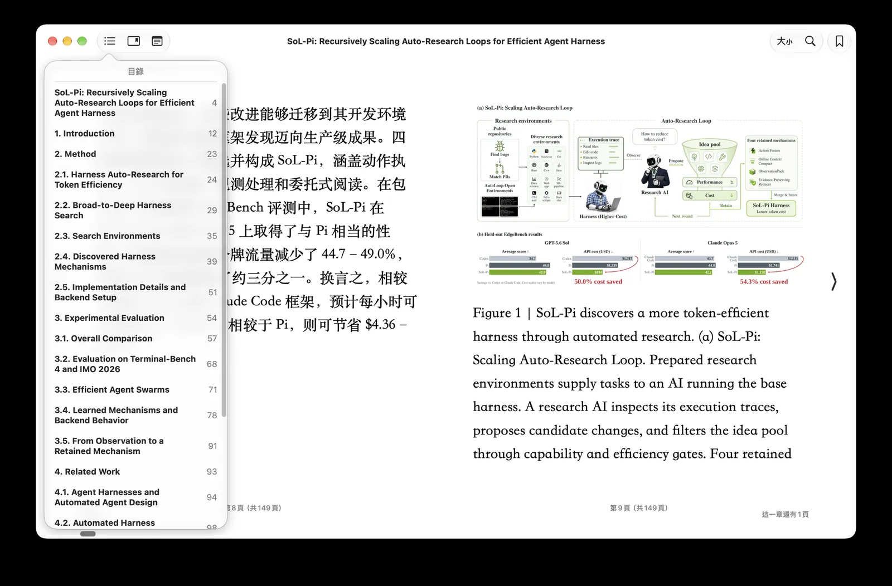

<div align="left">

# Bilingual Book Maker

**[中文](./README-CN.md) | English**


The bilingual_book_maker is an AI translation tool that uses ChatGPT to assist users in creating multi-language versions of epub/txt/md/srt/pdf files and books. Use it only with material you have the right to translate — works for which you hold the necessary rights, suitably licensed or permitted works, public-domain books, or uses otherwise allowed by applicable law. Before using this tool, please review the project's **[disclaimer](./disclaimer.md)**.

[](https://github.com/yihong0618/bilingual_book_maker/stargazers)
[](https://github.com/yihong0618/bilingual_book_maker/actions/workflows/make_test_ebook.yaml)
[](https://pypi.org/project/bbook-maker/)
[](https://www.python.org/downloads/)
[](./LICENSE)
[](https://github.com/psf/black)
[](https://github.com/BerriAI/litellm)

</div>


## Supported endpoints

OpenAI and Anthropic format endpoints are supported.
Usually it comes with three fields, two if you are using the official endpoints, such as `gpt-5.6-luna` (the default)
or `claude-sonnet-4-6`. 
Specify `openai`, or `anthropic` at `--api_format` for API request formats.
This argument also supports selecting some machine-translation engines (`google`, `caiyun`, `deepl`, `deeplfree`,
`tencent`, `customapi` — not an OpenAI format) or `codex`
if you want to use your Codex quota instead. 

`--provider` is an alternative way to pass credentials, through a JSON config file
`bbm_providers.json`. 

Epub tags classification is auto enabled on JSON-schema endpoints, and on any endpoint that can hold a conversation — the codex route and plain reseller proxies included — where the model is asked for exact `skip`/`translate` verdicts instead. Only routes with no conversation at all (the MT engines) fall back to translating `p` tags only, so some poetry or verse may be omitted there. See [Plan mode](#plan-mode) for details.

Older flags (`--model gpt4o`,
`--model gemini`, `--openai_key`, …) still work: see
[Models and languages](./docs/model_lang.md).

## Preparation

1. ChatGPT or OpenAI token [^token]
2. epub/txt/md/pdf books
3. Environment with internet access or proxy
4. Python 3.10+

## Quick Start

A sample book, `test_books/animal_farm.epub`, is provided for testing purposes.
`--test` translates only its first few paragraphs.

```shell
pip install -r requirements.txt      # or: pip install -U bbook_maker
```

Then:

```shell
cp bbm_providers.example.json bbm_providers.json
# edit base_url, default_models and env_key in ./bbm_providers.json
python3 make_book.py --book_name test_books/animal_farm.epub --provider openai --test --use_context session
```

You can also pass the key on the command line:

```shell
python3 make_book.py --book_name test_books/animal_farm.epub \
  --key sk-... --model gpt-5.6-luna --api_base https://api.openai.com/v1 --test --use_context session
```

To spend a [Codex](https://developers.openai.com/codex/cli) subscription:

```shell
python3 make_book.py --book_name test_books/animal_farm.epub --model gpt-5.6-luna --api_format codex --test
```

Or hand it to a coding agent

```shell
git clone https://github.com/yihong0618/bilingual_book_maker.git
cd bilingual_book_maker
codex "Hi, please use bbm-plan to translate this book: test_books/animal_farm.epub into a bilingual Chinese-English edition, thanks."
```

## Endpoint flags

- `--api_format` names the API the endpoint speaks: `openai`, `anthropic`,
  `gemini`, `qwen`, `groq`, `xai`, `litellm`, `codex`, or one of the
  machine-translation engines (`google`, `caiyun`, `deepl`, `deeplfree`,
  `tencent`, `customapi`). A format that belongs to one vendor already
  knows that vendor's address, so the format and a `--key` are a whole
  command.
- **Any other OpenAI-compatible API**: `--api_base` (ending in `/v1`),
  `--key` the API key, and the model id in `--model`. Omit `--api_base` for
  OpenAI's own API, and `--model` for `gpt-5.6-luna`.
- Or translate through `--provider`: `bbm_providers.example.json` has an
  entry for each vendor below (Gemini, Qwen, xAI, Groq, OrcaRouter, Ollama,
  LiteLLM, SiliconFlow, OpenRouter). Copy it to
  `bbm_providers.json`, set the key in it, and `--provider gemini` uses the
  Gemini API from it.
- `--use_context session` translates in session mode; the history compacts
  at 8k by default (`--context-compact-at` overrides). It keeps one cached
  history for consistency, so recurring names stay stable across the book,
  and can also learn a glossary from its own handoff reports
  (`--glossary-auto on`, off by default) — the recommended mode on
  OpenAI-compatible endpoints, and what the examples below use.
- The old preset names and key flags still work, see
  [Migrating from the old flags](./docs/migration.md).

## Supported translation services
* DeepL
  Support DeepL model [DeepL Translator](https://rapidapi.com/splintPRO/api/dpl-translator) need pay to get the token

  ```
  python3 make_book.py --book_name test_books/animal_farm.epub --api_format deepl --key ${deepl_key}
  ```

* DeepL free

  ```shell
  python3 make_book.py --book_name test_books/animal_farm.epub --api_format deeplfree
  ```

* [Claude](https://console.anthropic.com/docs)

  A `claude-*` model id selects the anthropic format on its own.

  ```shell
  python3 make_book.py --book_name test_books/animal_farm.epub --model claude-sonnet-4-6 --key ${claude_key}
  ```

* Google Translate

  ```shell
  python3 make_book.py --book_name test_books/animal_farm.epub --api_format google
  ```

* Caiyun Translate

  ```shell
  python3 make_book.py --book_name test_books/animal_farm.epub --api_format caiyun --key ${caiyun_key}
  ```

* Gemini

  Google [Gemini](https://aistudio.google.com/app/apikey), over the Gemini
  API itself. Name any Gemini model id; without `--model` it is
  `gemini-flash-latest`. `--interval` sets the pause between requests, which
  is how the free tier's rate limit is stayed under.

  ```shell
  python3 make_book.py --book_name test_books/animal_farm.epub --api_format gemini --key ${gemini_key} --model gemini-flash-latest
  ```

* Qwen

  [Qwen-MT](https://www.aliyun.com/product/dashscope) on DashScope, a
  translation model: the request states a source and a target language.
  `qwen-mt-turbo` (the default) and `qwen-mt-plus` are supported, and
  `--source_lang` states the source language when auto-detection is not
  wanted.

  ```shell
  python3 make_book.py --book_name test_books/animal_farm.epub --api_format qwen --key ${qwen_key} --model qwen-mt-turbo --language "Simplified Chinese"
  ```

* [Tencent TranSmart](https://transmart.qq.com)

  ```shell
  python3 make_book.py --book_name test_books/animal_farm.epub --api_format tencent
  ```

* [xAI](https://x.ai)

  ```shell
  python3 make_book.py --book_name test_books/animal_farm.epub --api_format xai --key ${xai_key} --model grok-4.3 --use_context session
  ```

* [OrcaRouter](https://www.orcarouter.ai)

  The [OrcaRouter](https://www.orcarouter.ai) gateway, defaulting to its
  `orcarouter/auto` smart routing. The address comes with the route, so there
  is no `--api_base`; the key is `--key` or `BBM_ORCAROUTER_API_KEY`.
  `--provider orcarouter` reaches the same place.

  ```shell
  python3 make_book.py --book_name test_books/animal_farm.epub --model orcarouter --key ${orcarouter_key} --use_context session
  ```

  To name one model instead: `--provider orcarouter --model <id>`.

* [Ollama](https://github.com/ollama/ollama)

  Translate with [Ollama](https://github.com/ollama/ollama) self-hosted models.
  If the ollama server is not local, point `--api_base http://x.x.x.x:port/v1` at it.

  ```shell
  python3 make_book.py --book_name test_books/animal_farm.epub --api_base http://localhost:11434/v1 --model ${ollama_model_name} --use_context session
  ```

* [groq](https://console.groq.com/keys)

  `--model` is required: GroqCloud's catalogue turns over, so pick a current
  id from [Supported Models](https://console.groq.com/docs/models).

  ```shell
  python3 make_book.py --book_name test_books/animal_farm.epub --api_format groq --key [your_key] --model llama-3.3-70b-versatile --use_context session
  ```

* [LiteLLM](https://docs.litellm.ai/docs/simple_proxy)

  A LiteLLM proxy, which fans out to whatever backends its own config names.
  `--model` is the name that config gives one of them. The default address is
  the proxy's own, on this machine; elsewhere it is `--api_base`.

  ```shell
  python3 make_book.py --book_name test_books/animal_farm.epub --api_format litellm --model ${name_in_your_litellm_config} --use_context session
  ```

* [Codex](https://developers.openai.com/codex/cli)

  Spend your ChatGPT/Codex plan. Install the
  [Codex CLI](https://developers.openai.com/codex/cli). The default model is `gpt-5.6-luna`; `--api_format codex --model <id>` names another. One session is reused for the whole book and compacted at `--context-compact-at`;
  it runs sandboxed, with shell, MCP servers and browsing off, but hooks may still fire.

  ```shell
  python3 make_book.py --book_name test_books/animal_farm.epub --api_format codex --language zh-hans
  ```

## Custom API Provider

  When the built-in models do not cover your needs, define a provider in a JSON config file. Without a code change, any OpenAI-compatible or Anthropic-format API (SiliconFlow, a local proxy, ...) becomes usable.

  Create `bbm_providers.json` in the current directory (or `~/.bbm/providers.json`):

  ```json
  {
    "providers": {
      "siliconflow": {
        "api_style": "openai",
        "base_url": "https://api.siliconflow.cn/v1",
        "default_models": ["Qwen/Qwen2.5-72B-Instruct"],
        "env_key": "BBM_SILICONFLOW_API_KEY"
      },
      "openai": {
        "api_style": "openai",
        "base_url": "https://api.openai.com/v1",
        "default_models": ["gpt-5.6-luna"],
        "env_key": "OPENAI_API_KEY",
        "prices": {
          "gpt-5.6-luna": {"input": 0.20, "output": 1.20, "cached_input": 0.02}
        }
      }
    }
  }
  ```

  Config fields:

  | Field | Required | Description |
  |-------|----------|-------------|
  | `api_style` | Yes | API request format: `openai`, `anthropic`, `gemini`, `qwen`, `groq`, `xai` or `litellm` |
  | `base_url` | No | The API address. Omitted means the api_style's default address |
  | `default_models` | No | Default model list. Required if `--model` is not provided |
  | `env_key` | No | Environment variable name for API key. Required if `--key` is not provided |
  | `prices` | No | Prices per million tokens, per model: `{"<model id>": {"input": …, "output": …, "cached_input": …}}`. When every model in the run has a price, the progress bar shows money spent (`spent=$0.012`) instead of token counts, and the closing line shows both. Without `cached_input`, cache reads are charged at the input price. A model without a price puts the bar back on tokens, and the closing line names it |
  | `currency` | No | Currency code for the prices, default `USD`. `USD`, `EUR`, `GBP`, `CNY` and `JPY` print with their symbol; any other code prints after the amount, as in `0.500 CHF` |

  The spent amount and the token counts are estimates, accumulated from the usage each request reports — close enough to steer by, but the vendor's bill is the number that counts.

  Priority: project-level `./bbm_providers.json` overrides global `~/.bbm/providers.json`.

  `--model` names a model at that provider; without it the first of `default_models` is used.

  ```shell
  python3 make_book.py --provider siliconflow --key sk-xxx --book_name test_books/animal_farm.epub --use_context session

  export BBM_SILICONFLOW_API_KEY=sk-xxx
  python3 make_book.py --provider siliconflow --book_name test_books/animal_farm.epub --use_context session
  ```

## Usage

- Once the translation is complete, a bilingual book named `${book_name}_bilingual.epub` would be generated for EPUB inputs; for TXT, MD and SRT inputs a bilingual file named `${book_name}_bilingual.txt`, `${book_name}_bilingual.md` or `${book_name}_bilingual.srt` will be generated. For **PDF inputs** the tool will produce a bilingual `.txt` fallback and will also attempt to create `${book_name}_bilingual.epub` — if EPUB creation fails, the TXT fallback remains so you do not need to retranslate.
- If there are any errors or you wish to interrupt the translation by pressing `CTRL+C`, a temporary bilingual file (for example `{book_name}_bilingual_temp.epub` or `{book_name}_bilingual_temp.txt`) would be generated. You can simply rename it to any desired name.

## Features

The three switches that change how a book is read and translated, rather than
where the requests go. Each is one flag; the rest of this section is when to
reach for it and what to watch.

### Plan mode

**What it does.** By default an EPUB is translated through a plan: the loader
partitions the whole book into units (paragraphs, headings, list items, table
cells, blockquotes, verse lines, captions, any block that carries text),
groups them by tag signature, asks the model which signatures are worth
translating, and writes the answer to `<book>_plan.json`. Consecutive units
then share one request up to the token budget (`--accumulated_num`) and the
unit cap (`--max-batch-units`), which is what makes verse and short lines
cheap. Without a plan, only the `--translate-tags` selection is translated,
`<p>` by default, and poetry or a table sitting outside `<p>` is silently left
in the source language.

**When to use it.** Always, on an EPUB with an LLM route; it is the default and
needs no flag. Preview first when the book is unusual (a textbook, a bilingual
edition, a book whose body is not in `<p>`): `--plan-dry-run` prints the
per-signature coverage table and writes the plan file without a key and
without translating anything, so you can see what will be skipped before
paying; it honours `--only_filelist` / `--exclude_filelist`. Turn it off with `--plan-classify none` when you want the old
`--translate-tags` behaviour exactly.

```shell
# preview: what would be translated, what skipped (no key needed)
python3 make_book.py --book_name my_book.epub --plan-dry-run
# the default run classifies with the translating model, then translates
python3 make_book.py --book_name my_book.epub --key ${key}
# no classification: translate every unit of the partition
python3 make_book.py --book_name my_book.epub --key ${key} --plan-classify all
# decide the plan yourself, or with a coding agent: the run stops after
# writing the plan and printing instructions; rerun the same command to translate
python3 make_book.py --book_name my_book.epub --key ${key} --plan-classify agent
```

- `--plan-classify` picks how the plan is decided: `auto` (the default: the
  translating model rules, over a JSON schema where the endpoint verifiably
  applies one, otherwise over a plain conversation with exact
  `skip`/`translate`/`unsure` replies; unsure and unparsable rows are
  translated), `none`, `all`, `model` (the same as auto, but an unresolved
  row stops the run instead of falling back), `agent`.
  `--classify-model X` classifies with another model (`--plan-classify-model`
  is its old name), or a Jev-compatible classifier (TypeSafe's Jev by
  default; Simple Jev at its URL), where `--classify-min-confidence` moves
  the gate (default 0.95, measured); set explicitly, a classification failure aborts instead
  of falling back. `--classify-base-url URL` asks it at another
  OpenAI-compatible endpoint, with `--classify-key KEY`.
- `--plan-min-coverage` (default 0.5): the run aborts when the plan covers
  less than this fraction of the book's text. `0` disables the guard; values
  above 0.9 tend to abort after the classification is already paid for.
- `<book>_plan.json` is reused by every later run of the same book, `--test`
  included; delete it to classify again. A `--test` run classifies the whole
  book, not the slice, and says so.

**Caveats.**

- EPUB only. Markdown, txt and srt books have no tags to plan, and the plan
  flags are reported as ignored there.
- On a route with no conversation (`google`, `deepl`, `caiyun`, `tencent`,
  `customapi`) there is no model to ask, so the run falls back to the
  `--translate-tags` selection; asking for `--plan-classify model` there stops.
- An automatic plan gives way to tag mode, with a printed reason, when it
  cannot be built or when the run resumes a checkpoint written in tag mode;
  an explicitly requested plan stops instead. `--retranslate`, `--batch` and
  `--sentence_mode` contradict a plan and are not combined with one.
- Small and on-device models: the plain-conversation classifier only needs
  one-word answers, and anything else is translated by policy, so a weak
  model errs towards translating too much rather than too little. Rows it
  decided are marked `unnamed (…)` in the plan file. If the classification
  keeps failing, `--plan-classify all` skips it. The grouping defaults are
  deliberately small for the same reason; raise `--accumulated_num` and
  `--max-batch-units` on a strong endpoint, and lower them again when the run
  prints misalignment-recovery hints.
- `--parallel-workers` with grouping (`--accumulated_num` above 1) records no
  progress, so `--resume` cannot continue such a run; the three together are
  refused.

### Session mode

**What it does.** `--use_context session` keeps one append-only conversation
for the whole book instead of re-sending a few recent pairs with each request
(the bare `--use_context`, window mode). Every request carries the history, so
on an endpoint with prompt caching the model reads the last chapter or so at
the cache rate and keeps names, register and terminology consistent. When the
history reaches `--context-compact-at` (default `8192` estimated tokens, the
seed included), the model writes a short handoff report, about 300 tokens,
whose summary opens the next window; `<book>_handoff.md` holds the latest one
and `--resume` reads it back.

**When to use it.** Fiction and any long text where the same names and terms
recur, on an endpoint that caches prompts (OpenAI, Anthropic, and most
gateways in front of them). It is also the right setting for a paper on the
PDF route, which extracts into many short blocks. Prefer window mode when the
endpoint has no cache, when the model's context is small, or when you want
`--parallel-workers`. The codex route is a session whether asked or not: its
thread is the history.

```shell
python3 make_book.py --book_name my_book.epub --key ${key} --use_context session
# a model with a small input limit: bound the window to it (minimum 1500)
python3 make_book.py --book_name my_book.epub --key ${key} --use_context session --context-compact-at 4000
# roll over without a handoff report (cheaper, no continuity across the seam)
python3 make_book.py --book_name my_book.epub --key ${key} --use_context session --no-context-compact
```

- `--context-compact-at N`: the budget for the whole window, handoff seed
  included, so it can be set to the model's input limit. Minimum `1500`;
  below that a window is mostly seed and seams, so use window mode instead.
  On endpoints that classify the plan over a plain conversation it also
  bounds the classifier's own thread (which restarts there, no handoff).
- `--no-context-compact`: never ask for the report; the next window starts
  empty.
- `--glossary-auto on` keeps the renderings each handoff report establishes,
  so recurring names survive the seams. It relies on the model reporting its
  own renderings accurately, so it wants a capable model; the summary already
  carries the recurring names, and `--glossary` pins the ones that matter
  without needing either.

**Caveats.**

- Watch the progress bar's `cached=`. If it is still zero after a dozen
  requests, the endpoint has no prompt cache and every request is paying for
  the whole history at full price: Ctrl+C and rerun with window mode.
- Refused with `--parallel-workers` (one history cannot be shared between
  workers) and with `--model_list` (caches are per model, and one
  conversation would be written by several).
- EPUB and Markdown books only; txt and srt loaders do not carry a context,
  and the compact flags are reported as ignored there.
- Outside plan mode (a Markdown book, or `--plan-classify none`) grouping is
  off, so every paragraph is its own request and each one re-reads the whole
  history. Raise `--accumulated_num` so several paragraphs share a request;
  the run warns about this at start.
- The handoff is written by the model. On a small model the report can be
  poor; if the text after a compaction drifts, pin terms with `--glossary`,
  or pass `--no-context-compact` and accept an empty seam.
- Ctrl+C leaves the usual checkpoint; `--resume` continues the run and reads
  `<book>_handoff.md` back, so the next window still inherits the summary.

### PDF to **bilingual** EPUB (experimental)

**What it does.** `--to-epub` reads the PDF with
[docling](https://github.com/docling-project/docling)'s layout and table models
into Markdown, translates that Markdown with the Markdown loader, and has
Pandoc build a reflowable **bilingual** EPUB whose navigation follows the
headings: every paragraph of the paper followed by its translation, in a
book that reflows and has a table of contents. The working bundle is `<name>_book/` beside the PDF: `source.md`,
the extracted images, `book_bilingual.md` and a manifest; the finished book is
copied out as `<name>_bilingual.epub`. Rerunning the same command reuses the
extraction and a finished translation; delete `book_bilingual.md` to translate
again, or edit `source.md` before the translation runs. Without the flag a PDF
takes the older route, which writes a bilingual `.txt` and the `--pdf_layout`
outputs.

**When to use it.** A paper or a typed book you want to read on an e-reader,
with a table of contents. The route accepts every Markdown-loader flag
unchanged: `--use_context session` (recommended, a PDF extracts into many
short blocks), `--glossary`, `--parallel-workers` (not with a session),
`--test` for a cheap first look.

```shell
# first look: extract, then translate only the first few blocks
python3 make_book.py --book_name paper.pdf --to-epub --key ${key} --test
# the full run
python3 make_book.py --book_name paper.pdf --to-epub --key ${key} --use_context session
# a scanned PDF
python3 make_book.py --book_name scan.pdf --to-epub --pdf-ocr --key ${key} --use_context session
# one chapter: pages 12 to 30 only, into paper_pages-12-30_bilingual.epub
python3 make_book.py --book_name paper.pdf --to-epub --pages 12-30 --key ${key} --use_context session
# a scanned Chinese book: name the script the OCR models read
python3 make_book.py --book_name scan.pdf --to-epub --pdf-ocr --ocr-lang iso:zh --key ${key} --use_context session
```

- `--pdf-ocr` reads pages that carry **no text layer** — a scan. Such a page
  is refused without it, never silently skipped. It is off by default because
  a born-digital PDF is already readable and OCR costs several times the time
  without changing what is read. Layout, headings and table detection run
  either way; OCR is not what makes the extraction good.
- `--device` chooses where the models run: `auto` (the default) detects an
  accelerator — NVIDIA CUDA, or Apple silicon's MPS from a native install —
  and falls back to the CPU on its own. `--device cpu` forces the processor.
  **CPU is fully supported and produces the same text**; it is slower, and
  that is the only difference. `--device cuda` on a machine or a PyTorch build
  that cannot provide it is refused by name, with the two cases distinguished.
- `--ocr-lang` names the languages the OCR engine reads on pages with no
  text layer, comma separated, as portable `iso:` tags (`iso:zh-Hans`,
  `iso:zh-Hant`, `iso:ja`, `iso:ko`, `iso:en`) or in the engine's own codes.
  The engine is the one docling selects on your install (rapidocr with the
  shipped requirements; ocrmac or easyocr if you installed them), and every
  OCR run prints the engine and languages it used. rapidocr's default reads
  Chinese and English and takes one language per run (the first code), so
  a Japanese, Korean, Cyrillic or Arabic scan needs the flag, and without
  it comes back empty or as the wrong characters; the run says so when it
  meets a scanned page without the flag. The first use of a language
  downloads its model (tens of megabytes). On a typed PDF the flag changes
  nothing; rerunning a scan with other languages, or with `--pdf-ocr`
  toggled, reads it again.
- `--ocr-replace-layer` (with `--pdf-ocr`) has the OCR engine read every
  page and drop the PDF's own text layer. Off by default: an existing layer
  is kept. It measured worse than a sound layer; use it for a layer that is
  wrong. A page it reads nothing on stays empty and is named on the terminal.
- `--pages` reads only the pages named, numbered from 1 (`12-30`, or
  `1,3,5-7`); the rest of the PDF is left out of the book, and nothing else
  is extracted or paid for. The selection goes into the names, so a chapter
  run sits beside the whole-book run instead of overwriting it:
  `<name>_pages-12-30_book/` and `<name>_pages-12-30_bilingual.epub`.
  Rerunning the same selection resumes that bundle. The contents keep only
  the headings inside the selection; when it starts inside a section, the
  prose before the first heading gets a heading naming the page (`Page 12`),
  written into `source.md` before translation, so rename it there if you
  like. A selection with a gap in it (`1,5-7`) reads the whole run it spans
  and drops the rest afterwards; the run says so.
- **Display formulas are kept as pictures.** The parser finds an equation but
  does not read it, so each one is cropped out of the page and placed where it
  stood; the prose around it is translated, the equation is not. This is why a
  maths book survives the route at all — without it every display equation
  would be a `<!-- formula-not-decoded -->` placeholder and the mathematics
  would simply be missing. It costs no model, no network and no measurable
  time. `--no-formula-images` turns it off and restores the placeholders.
  **Inline** mathematics inside a paragraph is not a formula region and is not
  covered: on a scan it arrives as whatever OCR made of it.
- **A vision model can correct the layout detector's region roles**
  (`--img-model MODEL`, or the provider entry's `img_model`; off unless one
  is named, and never the run's own model by fallback; `--img-model none`
  turns a provider's image model off). Docling sometimes calls an
  author line a heading, a listing's lines footnotes, or a figure's label a
  section; with the flag, each page is shown to the named model with the
  detector's boxes drawn on it, and the model answers one role per region
  (text, heading, title, caption, footnote, code, or abstain). Accepted
  answers are applied before export, so the contents and the code blocks
  come out right; text is never rewritten. It needs an OpenAI-compatible
  endpoint that accepts images (the run's own endpoint, or
  `--img-base-url URL` with `--img-key KEY`; probed once); where
  the model abstains or the endpoint cannot see the page, the detector's
  labels stand and the terminal says so. Measured on gpt-5.6-luna: 40 of 66
  catalogued label faults fixed, about 3k prompt tokens per page.
- Requirements: the **`pdf` extra**, which is not part of the base install.
  It is not in the published package yet, so install it from a checkout —
  `pip install -r requirements-pdf-gpu.txt` (`pip install ".[pdf]"` does the
  same thing without pinning). It brings docling and PyTorch, so on Linux
  without an NVIDIA GPU install it from PyTorch's CPU index (~380 MB instead
  of ~3.2 GB), and on **Windows with an NVIDIA GPU** install it from the CUDA
  index, because PyPI's Windows wheel is CPU-only and the plain install
  silently leaves you on the processor — that case also needs the NVIDIA
  driver (<https://www.nvidia.com/en-us/drivers/>). On macOS there is nothing
  to choose. The models
  themselves (~500 MB) download on the first run.
  **[docs/installation-pdf.md](docs/installation-pdf.md) has the exact command
  for every case.** Also [Pandoc](https://pandoc.org/installing.html)
  **3.1.12 or newer** on PATH (`pandoc -v`; Ubuntu 24.04 and Debian 13 apt
  ship older releases, so take the release from pandoc.org). **No Java** — the
  Java engine this route once used was retired in 2026-09. A missing
  requirement is refused before the PDF is opened, with a message naming it.

**Caveats.**

- **Read `source.md` before paying for the full translation**, the headings
  at least: they become the table of contents. Heading detection is good on
  papers and much weaker on other producers; a Word-exported PDF can arrive
  with almost none. Fix the Markdown in the bundle and rerun; the extraction
  is not repeated.
- Figures stay pictures and their labels are not translated. A page that
  extracts far more text than a printed page holds is warned about; inspect
  that page.
- The extractor does not escape Markdown syntax in prose. A sentence with
  `\s`, `[u](y)` or `<k>` can be refused before translation as raw TeX, a
  missing link target or raw HTML; the message names the block. Escape it in
  `source.md` and rerun.
- The EPUB carries no `bbm_translation_metadata.json` and no embedded
  glossary (Pandoc builds it), and `--no_disclosure` is not honoured on this
  route yet: the credit line is always added. `--glossary-auto` learns only
  when a compaction happens, so a short paper at the default budget learns
  nothing.
- Every PDF flag other than `--to-epub` is reported as ignored when the route
  is not taken, and `--to-epub` on a non-PDF book stops the run.

This route is experimental: it has been checked on arXiv papers and a handful
of other producers, not on every PDF shape. Issues and PRs are welcome; attach
the PDF if it can be shared, or the page of `source.md` that came out wrong.

Set expectations by the format. A PDF is a page description, not a document:
it stores glyphs at positions and knows nothing of paragraphs, headings,
columns or reading order, so every extractor has to guess the structure back.
A bilingual, reflowable EPUB with a working table of contents out of that is
already a good result; a heading that lands one level off or a table that
arrives as prose is the format showing through, not a broken run, and both
are a minute's edit in `source.md`.



## Params

- `--model`:

  The model id, exactly as the endpoint spells it. On the OpenAI format the default is `gpt-5.6-luna`. The second column is the `--api_format` the id needs:

  | model | `--api_format` | notes |
  |-------|---------------|-------|
  | `gpt-5.6-luna` | `openai` | the default, at OpenAI's own address |
  | `claude-sonnet-4-6` | `anthropic` | Anthropic's own address |
  | `gpt-4o-mini` | `openai` | OpenAI |
  | `gemini-flash-latest` | `gemini` | the default there, at Google's own address |
  | `qwen-mt-turbo` | `qwen` | the default there, on DashScope |
  | `llama-3.3-70b-versatile` | `groq` | Groq's own address |

  The old preset values still parse and are rewritten to a real model id with a note; [Migrating from the old flags](./docs/migration.md) lists them. Anything else is an endpoint: `--api_base <url> --key <key> --model <id>`, or a `--provider` entry (see the Custom API Provider section).

- `--key`:

  API key for the endpoint. Without the flag the key is read from `$BBM_API_KEY`, then from the format's own variable. Same flag as `--api_key`.

- `--api_format`:

  The API the endpoint speaks. When omitted it is inferred: an `anthropic.com` host, or a model id containing `claude` with no `--api_base`, means `anthropic`; anything else means `openai`. Pass it when the guess is wrong, to reach a vendor without typing its address, or to pick an engine.

  | format | key | notes |
  |--------|-----|-------|
  | `openai` (default) | required: `--key`, else `$BBM_API_KEY`, `$OPENAI_API_KEY`; not for a local address such as Ollama | any OpenAI-compatible endpoint: OpenAI itself, OpenRouter, Ollama and the rest, the address in `--api_base` |
  | `anthropic` | required: `--key`, else `$BBM_API_KEY`, `$ANTHROPIC_API_KEY` | Anthropic itself, and gateways that speak the Messages API |
  | `gemini` | required: `--key`, else `$BBM_API_KEY`, `$BBM_GOOGLE_GEMINI_KEY`, `$GEMINI_API_KEY` | the Gemini API, default `gemini-flash-latest`; paced by `--interval` |
  | `qwen` | required: `--key`, else `$BBM_API_KEY`, `$BBM_QWEN_API_KEY`, `$DASHSCOPE_API_KEY` | Qwen-MT on DashScope, default `qwen-mt-turbo`; reads `--source_lang` |
  | `groq` | required: `--key`, else `$BBM_API_KEY`, `$BBM_GROQ_API_KEY`, `$GROQ_API_KEY` | GroqCloud; `--model` required |
  | `xai` | required: `--key`, else `$BBM_API_KEY`, `$BBM_XAI_API_KEY`, `$XAI_API_KEY` | xAI; `--model` required |
  | `litellm` | none for a proxy on this machine, else `--key` or `$LITELLM_MASTER_KEY` | a LiteLLM proxy, `http://localhost:4000` unless `--api_base` says otherwise; `--model` required |
  | `codex` | none: `codex login` (Codex CLI) | the local `codex app-server` sidecar on a ChatGPT/Codex plan, default `gpt-5.6-luna` |
  | `orcarouter` | required: `--key` or `$BBM_ORCAROUTER_API_KEY` | OrcaRouter |
  | `google` | none | Google Translate, free |
  | `caiyun` | required: `--key` or `$BBM_CAIYUN_API_KEY` | Caiyun |
  | `deepl` | required: `--key` or `$BBM_DEEPL_API_KEY` | DeepL (paid) |
  | `deeplfree` | none | DeepL free tier |
  | `tencent` | none | Tencent TranSmart, free |
  | `customapi` | none | a `{text, source_lang, target_lang}` format API |

- `--interval`:

  Seconds to wait between requests, e.g. `--interval 0.1` for 100ms. Only `--api_format gemini` paces itself with it; every other route ignores it. Default: `0.01`.

- `--test`:

  Use `--test` option to preview the result if you haven't paid for the service. Note that there is a limit and it may take some time.

- `--language`:

  Set the target language: a tag (`--language zh-hant`), a name (`--language "Traditional Chinese"`), or both at once — `--language "zh-hant:Traditional Chinese"`. The tag names the JSON structured-output field; the name is what the model is asked for. Default `zh-hans`. See also [available tags](./docs/languages.md).

- `--source_lang`:

  Source language. Stated, it appends a prompt line ("Translate from English"), and on `--api_format qwen` (whose request names a language pair) and `--api_format customapi` it rides in the request itself. Default: auto-detect.

- `--proxy`:

  Use `--proxy` option to specify proxy server for internet access. Enter a string such as `http://127.0.0.1:7890`.

- `--resume`:

  Use `--resume` option to manually resume the process after an interruption. Mutually
  exclusive with `--parallel-workers`.

  ```shell
  python3 make_book.py --book_name test_books/animal_farm.epub --api_format google --resume
  ```

- `--translate-tags`:

  epub is made of html files. By default, we only translate contents in `<p>`.
  Use `--translate-tags` to specify tags need for translation. Use comma to separate multiple tags.
  For example: `--translate-tags h1,h2,h3,p,div`

- `--plan-classify` (epub only), `--plan-dry-run`, `--plan-min-coverage`, `--max-batch-units`:

  Plan mode: the whole book is partitioned and the model decides which tag signatures to translate. On by default for EPUBs; see [Plan mode](#plan-mode) for the values, the preview and the caveats.

- `--exclude-translate-tags`:

  Use `--exclude-translate-tags` to exclude content within specified HTML tags from translation. This is useful for preserving code blocks, preformatted text, or other special content. Use comma to separate multiple tags.
  Default: `sup,code`.
  For example: `--exclude-translate-tags code,pre`

  **Tip**: Use `--exclude-translate-tags ""` to translate all content including code blocks (overrides the default exclusion).

- `--api_base`:

  If you want to change api_base like using Cloudflare Workers, use `--api_base <URL>` to support it.
  **Note: the api url should be '`https://xxxx/v1`'. Quotation marks are required.**

- `--allow_navigable_strings`:

  If you want to translate strings in an e-book that aren't labeled with any tags, you can use the `--allow_navigable_strings` parameter. This will add the strings to the translation queue.

- `--prompt`:

  To tweak the prompt, use the `--prompt` parameter. The placeholders the `user` template may use are `{text}` (required), `{language}` and `{crlf}` (a newline, for the shapes — a JSON string, a table cell — that cannot carry one). Anything else in braces is refused before the run starts rather than raising mid-book; write `{{` and `}}` for a literal brace. It supports a few ways to configure the prompt:

  - If you don't need to set the `system` role content, you can simply set it up like this: `--prompt "Translate {text} to {language}."` or `--prompt prompt_template_sample.txt`

  - If you need to set the `system` role content, you can use the following format: `--prompt '{"user":"Translate {text} to {language}", "system": "You are a professional translator."}'` or `--prompt prompt_template.json`.

  - A third key, `style`, is a standing instruction about how to write — register, tone, vocabulary. It is said **once where a window starts**, not repeated on every request.

  - `--prompt` works on every LLM route, and on srt books too — there its sections sit on top of the subtitle loader's own prompt, section by section. Replacing the `user` template on an srt book means saying yourself that the block number and the timeline must come back unchanged; the run warns about it. The fixed machine-translation routes (google, deepl, caiyun, tencent, qwen, customapi) send text and nothing else, so they carry no prompt at all and the run says so at start.
  
  - A `.md` file is read as the [PromptDown](https://github.com/btfranklin/promptdown) **block** form — the format is theirs, the reader is ours, so no extra package is installed: `--prompt prompt_md.prompt.md` (example at [./prompt_md.prompt.md](./prompt_md.prompt.md)). `## System Message`, an optional `## Style`, and a `## Conversation` whose `**User:**` turn is the template. The table form of a conversation is refused. Example:

      ```markdown
      # Translation Prompt

      ## System Message

      You are a professional translator who specializes in accurate translations.

      ## Conversation

      **User:**

      Please translate the following text into {language}:

      {text}
      ```

  - You can also set the `user` and `system` role prompt by setting environment variables: `BBM_CHATGPTAPI_USER_MSG_TEMPLATE` and `BBM_CHATGPTAPI_SYS_MSG`.

  - An example JSON file can be found at [./prompt_template.json](./prompt_template.json).

- `--batch_size`:

  Use the `--batch_size` parameter to specify the number of lines for batch translation (default is 10, currently only effective for txt files).

- `--accumulated_num`:

  Wait for how many tokens have been accumulated before starting the translation.
  For example, if you use `--accumulated_num 1600`, maybe openai will output 2200 tokens and maybe 200 tokens for other messages in the system messages user messages, 1600+2200+200=4000 — on some local models that is close to the limit. You have to choose your own value, there is no way to know if the limit is reached before sending.

  In EPUB plan mode this is a per-request token budget: consecutive units of any length share one request up to `N` tokens. Pass `1` to turn grouping off — every unit is sent on its own.

- `--use_context`:

  Translate with context.

- `--context_paragraph_limit`:

  Use `--context_paragraph_limit` to set a limit on the number of context paragraphs when using the `--use_context` option. This applies to window mode only.

- `--use_context session`, `--context-compact-at`, `--no-context-compact`:

  Session mode: one growing history instead of a re-sent window, compacted into a handoff report at the budget. See [Session mode](#session-mode) for when it pays and when it does not.

- `--glossary` / `--terminology`:

  A file of `term → translation` lines — one per line, `#` starts a note or a
  comment, plain text.
  Read by the openai- and codex-shaped routes for EPUB and Markdown books.

  A pinned term makes the translation say what you pinned, so pin only
  renderings you can stand behind.

  - `--glossary-auto on|off`:

    Keep the renderings the handoff reports establish, so recurring names
    stay unified across window seams. Session mode only, and off by
    default: it relies on the model reporting its own renderings
    accurately, which takes a capable model — most runs don't need it,
    since the handoff summary already carries the recurring names.

- `--parallel-workers`:

  Use `--parallel-workers` to process EPUB chapters or Markdown batches/sections in
  parallel. Values greater than `1` spin up multiple workers (recommended: `2-4`) and
  automatically fall back to sequential mode when there is only one unit of work. Other
  input loaders currently accept this shared CLI option but do not parallelize their work.

- `--temperature`:

  Sampling temperature for the openai and anthropic formats (the codex
  format has none). For example: `--temperature 0.7`.

- `--block_size`:

  Use `--block_size` to merge multiple paragraphs into one block. This may increase accuracy and speed up the process.
  For example: `--block_size 5`.

- `--single_translate`:

  Use `--single_translate` to output only the translated book without creating a bilingual version.

- `--no_disclosure`:

  An epub output adds "Translated by gpt-5.6-luna, 2026." below the book intro; this flag leaves it out. It also turns off the translation metadata (`--translation-metadata`: the model, the date and the glossary).

- `--translation_style`:

  Apply custom CSS to translated EPUB text, for example
  `--translation_style "color: #808080; font-style: italic;"`.

- `--translation_color`:

  Shorthand for setting only the translated EPUB text color, for example
  `--translation_color "#1e90ff"`. If `--translation_style` is also present, the full style
  takes precedence.

- `--pdf_layout {none,top-bottom,side-by-side,all}`:

  Select additional bilingual PDF outputs for PDF inputs. The default `none` creates no
  extra PDF; `all` attempts both top-bottom and side-by-side layouts. The bilingual TXT and
  EPUB outputs are unaffected.

- `--to-epub`, `--pdf-ocr`, `--ocr-lang`, `--ocr-replace-layer`, `--pages`, `--device` (PDF only):

  The PDF reading edition: the text layer becomes Markdown, the Markdown becomes a bilingual EPUB with navigation. See [PDF to bilingual EPUB](#pdf-to-bilingual-epub-experimental) for the bundle, OCR and what to check in `source.md`.

- `--ocr-engine {auto,rapidocr,easyocr,ocrmac,tesseract}` (PDF only, with `--to-epub --pdf-ocr`):

  The OCR engine. `auto` takes the first installed of ocrmac, rapidocr, easyocr; rapidocr ships with the `pdf` extra; on macOS `pip install ocrmac` adds Apple's engine with nothing to download. A named engine that is not installed is refused before any page is read. Which to choose: [docs/features/pdf-ocr-engines.md](docs/features/pdf-ocr-engines.md).

- `--sentence_mode`:

  Translate EPUB text sentence by sentence instead of translating each paragraph as one
  unit. It is incompatible with EPUB plan mode.

- `--batch` / `--batch-use`:

  Two-stage translation through the ChatGPT Batch API. Currently **refused on EPUB
  inputs**: the queue path is unreachable there, so such a run would translate live at
  full price and then submit an empty batch job instead of writing the book. Also refused
  on routes that do not implement the Batch API.

- `--quiet`:

  Suppress EPUB progress bars and per-paragraph source/translation echoes while retaining
  reports and errors. Recommended for log files and non-interactive agent runs.

- `--retranslate "$translated_filepath" "file_name_in_epub" "start_str" "end_str"`:

  Retranslate from start_str to end_str's tag:

  ```shell
  python3 "make_book.py" --book_name "test_books/animal_farm.epub" --retranslate 'test_books/animal_farm_bilingual.epub' 'index_split_002.html' 'in spite of the present book shortage which' 'This kind of thing is not a good symptom. Obviously'
  ```

  To retranslate only the tag containing `start_str`, pass an empty fourth argument:

  ```shell
  python3 "make_book.py" --book_name "test_books/animal_farm.epub" --retranslate 'test_books/animal_farm_bilingual.epub' 'index_split_002.html' 'in spite of the present book shortage which' ''
  ```

- `--no-thinking`:

  Ask the model not to reason before answering — thinking buys nothing on a
  paragraph of prose and costs tokens and time. Every endpoint spells the
  request field differently and rejects the others, so on the OpenAI-format
  routes the field is negotiated from the endpoint's own rejections and
  remembered for the run; if it refuses all of them the run says so once and
  carries on without one. On the `anthropic` route it is
  `thinking: {"type": "disabled"}`. The `codex` route is refused, since it
  runs the codex CLI as a subprocess with no request body. A field you set
  yourself in `--extra_body` wins over the flag.

  ```shell
  python3 make_book.py --book_name test_books/animal_farm.epub --key ${openai_key} --no-thinking
  ```

- `--extra_body`:

  Pass additional JSON parameters on the routes built on the OpenAI request
  path — `openai` and the OpenAI-format custom providers — and on the
  `anthropic` route. Provide a JSON object with the desired parameters.
  Example:

  ```shell
  python3 make_book.py --book_name test_books/animal_farm.epub --key ${openai_key} --extra_body '{"chat_template_kwargs": {"enable_thinking": false}}'
  ```

- `--extra_headers`:

  Extra HTTP headers sent with every request, on the same routes. Values
  must be strings.

  ```shell
  python3 make_book.py --book_name test_books/animal_farm.epub --key ${openrouter_key} --api_base https://openrouter.ai/api/v1 --model anthropic/claude-haiku-4.5 --extra_headers '{"HTTP-Referer": "https://example.com", "X-Title": "bilingual_book_maker"}'
  ```

  Common forms, for reference:

  ```shell
  # openai route — disable a local/vLLM chat template's thinking block
  --extra_body '{"chat_template_kwargs": {"enable_thinking": false}}'
  # openai route (chat completions) — reasoning effort and a token ceiling,
  # neither of which has its own flag (both model-dependent)
  --extra_body '{"reasoning_effort": "low", "max_completion_tokens": 2000}'
  # anthropic route — keep extended thinking off; for translation it mostly
  # buys deviation from the source, not quality
  --extra_body '{"thinking": {"type": "disabled"}}'

  # OpenRouter attribution (shown on its dashboard)
  --extra_headers '{"HTTP-Referer": "https://example.com", "X-Title": "bilingual_book_maker"}'
  # a gateway's own auth or routing header (the value stays out of the logs)
  --extra_headers '{"X-API-Key": "sk-gateway-..."}'
  ```

- `--provider`:

  Use a custom provider defined in `bbm_providers.json`; `--model` picks a model at it. See the "Custom API Provider" section above.

- `--api_key`:

  Same as `--key`.

### Examples

**Note if use `pip install bbook_maker` all commands can change to `bbook_maker args`**

```shell
# Test quickly
python3 make_book.py --book_name test_books/animal_farm.epub --key ${openai_key} --test --language zh-hans --use_context session

# Test quickly for src
python3 make_book.py --book_name test_books/Lex_Fridman_episode_322.srt --key ${openai_key} --test

# Or translate the whole book
python3 make_book.py --book_name test_books/animal_farm.epub --key ${openai_key} --language zh-hans --use_context session

# Gemini
python3 make_book.py --book_name test_books/animal_farm.epub --api_format gemini --key ${gemini_key} --model gemini-flash-latest

# Translate an EPUB with parallel chapter processing
python3 make_book.py --book_name test_books/animal_farm.epub --key ${openai_key} --parallel-workers 4

# Rotate across several models
python3 make_book.py --book_name test_books/animal_farm.epub --key ${openai_key} --model_list gpt-5-mini,gpt-4o-mini

# Set env OPENAI_API_KEY to leave out --key
export OPENAI_API_KEY=${your_api_key}

# Name a model and add context, translating to Japanese
python3 make_book.py --book_name test_books/animal_farm.epub --model gpt-4o --use_context --language ja

# Any OpenAI-compatible endpoint: base URL, key, and the model id it uses
python3 make_book.py --book_name test_books/animal_farm.epub --api_base "https://api.lingyiwanwu.com/v1" --key ${key} --model yi-34b-chat-0205 --use_context session

# DeepL, to Japanese
python3 make_book.py --book_name test_books/animal_farm.epub --api_format deepl --key ${deepl_key} --language ja

# Claude, to Japanese
python3 make_book.py --book_name test_books/animal_farm.epub --model claude-sonnet-4-6 --key ${claude_key} --language ja

# A custom translation API, to Japanese
python3 make_book.py --book_name test_books/animal_farm.epub --api_format customapi --api_base ${custom_api} --language ja

# A provider entry (e.g. SiliconFlow); the key comes from the entry's env_key
python3 make_book.py --book_name test_books/animal_farm.epub --provider siliconflow --language ja --use_context session

# Translate contents in <div> and <p>
python3 make_book.py --book_name test_books/animal_farm.epub --translate-tags div,p

# Plan mode: auto-discover translatable content (poetry, blockquotes, table cells,
# ...) and batch verse lines in stanza windows; preview the plan with --plan-dry-run
python3 make_book.py --book_name test_books/animal_farm.epub --plan-dry-run
python3 make_book.py --book_name test_books/animal_farm.epub --plan-classify all

# Tweaking the prompt
python3 make_book.py --book_name test_books/animal_farm.epub --prompt prompt_template_sample.txt
# or
python3 make_book.py --book_name test_books/animal_farm.epub --prompt prompt_template.json
# or
python3 make_book.py --book_name test_books/animal_farm.epub --prompt "Please translate \`{text}\` to {language}"

# translate txt file
python3 make_book.py --book_name test_books/the_little_prince.txt --test --language zh-hans
# aggregated translation txt file
python3 make_book.py --book_name test_books/the_little_prince.txt --test --batch_size 20

# Using Caiyun model to translate
# (the api currently only support: simplified chinese <-> english, simplified chinese <-> japanese)
# the official Caiyun has provided a test token (3975l6lr5pcbvidl6jl2)
# you can apply your own token by following this tutorial(https://bobtranslate.com/service/translate/caiyun.html)
python3 make_book.py --api_format caiyun --key 3975l6lr5pcbvidl6jl2 --book_name test_books/animal_farm.epub


# Set env BBM_CAIYUN_API_KEY to leave out --key
export BBM_CAIYUN_API_KEY=${your_api_key}

```

More understandable example

```shell
python3 make_book.py --book_name 'animal_farm.epub' --key sk-XXXXX --api_base 'https://xxxxx/v1' --use_context session

# Or python3 is not in your PATH
python make_book.py --book_name 'animal_farm.epub' --key sk-XXXXX --api_base 'https://xxxxx/v1' --use_context session
```

Microsoft Azure Endpoints

```shell
python3 make_book.py --book_name 'animal_farm.epub' --key XXXXX --api_base 'https://example-endpoint.openai.azure.com/openai/v1' --model 'deployment-name' --use_context session

# Or python3 is not in your PATH
python make_book.py --book_name 'animal_farm.epub' --key XXXXX --api_base 'https://example-endpoint.openai.azure.com/openai/v1' --model 'deployment-name' --use_context session
```

## Docker

You can use [Docker](https://www.docker.com/) if you don't want to deal with setting up the environment. Prebuilt images are published to GitHub Container Registry on every merge to `main` (as `latest`) and on every release tag:

```shell
docker pull ghcr.io/yihong0618/bilingual_book_maker:latest
```

Mount the folder containing your book at `/book` and pass the usual flags — the container accepts every `make_book.py` option, and the translated book is written back into the same folder:

```shell
# Linux / macOS
export folder_path=/path/to/your/books
export book_name=animal_farm.epub
export openai_key=sk-XXX
export language=zh-hans   # see the language list in book_maker/utils.py

docker run --rm -v "${folder_path}":/book ghcr.io/yihong0618/bilingual_book_maker:latest --book_name "/book/${book_name}" --key "${openai_key}" --language "${language}"
```

```powershell
# Windows PowerShell
$folder_path="C:\Users\user\mybook"
$book_name="animal_farm.epub"
$openai_key="sk-xxx"
$language="zh-hans"

docker run --rm -v ${folder_path}:/book ghcr.io/yihong0618/bilingual_book_maker:latest --book_name "/book/$book_name" --key $openai_key --language $language
```

For example, a quick test needing no key at all, over the free Google route:

```shell
docker run --rm -v /home/user/my_books:/book ghcr.io/yihong0618/bilingual_book_maker:latest --book_name /book/animal_farm.epub --api_format google --test --test_num 1 --language zh-hant
```

The container runs as root, so writing into the mounted folder always works; on Linux the files it writes there belong to root (`chown` them afterwards, or add `--user $(id -u)`). API keys can also be passed as environment variables (`-e OPENAI_API_KEY=sk-XXX`) instead of `--key`.

**The PDF route in Docker is the `pdf` tag.** The default image (`latest`, also
published as `basic`) has no Pandoc and no PDF packages, so it cannot run the
route, and it stays a few hundred megabytes. `ghcr.io/yihong0618/bilingual_book_maker:pdf` adds Pandoc and the PDF runtime — docling and PyTorch, which on amd64 means the CUDA build and several gigabytes — and runs `--to-epub` with or without `--pdf-ocr`:

```shell
docker run --rm -v "${folder_path}":/book -v bbm-models:/root/.cache ghcr.io/yihong0618/bilingual_book_maker:pdf --book_name /book/paper.pdf --to-epub --key "${openai_key}" --use_context session
```

The named volume keeps the docling models between runs; they download on the first `--to-epub` run. Two limits to know before reaching for it:

- **GPU** means NVIDIA CUDA, on **Linux and on Windows** — not macOS. On Linux, install the NVIDIA Container Toolkit on the host and add `--gpus all`; torch's wheels carry the CUDA runtime, so nothing else is needed. On Windows the same works through Docker Desktop's **WSL2 backend**, with the WSL-capable NVIDIA driver installed on Windows itself rather than inside WSL, and no CUDA Toolkit either; Windows-containers mode cannot do it. Without a GPU the same image runs on the processor — pass `--device cpu` to skip the detection. On macOS the container is CPU-only whatever you pass, because Docker runs a Linux VM that cannot see the Metal accelerator. For Apple silicon acceleration run the tool natively; it is also the smaller install, since the image ships the CUDA build of PyTorch either way.
- **On arm64 there is no GPU in this image**, even on a machine that has one. The image is published for both architectures, but PyPI's PyTorch is a CUDA build only on x86_64 — 821.0 MB there against 98.9 MB on aarch64, which carries no CUDA kernels at all. So an arm64 Linux host with a card (GH200, Jetson) pulls the arm64 manifest by default and runs on the processor no matter how many `--gpus` you pass. Add `--platform linux/amd64` to pull the CUDA image there.
- **The codex route** is not available in either image: it drives a `codex` binary that is signed in on the host, and neither the binary nor the login lives in the container. Use an API route in Docker.

To build the image yourself instead of pulling:

```shell
docker build --tag bilingual_book_maker .
docker run --rm -v /path/to/your/books:/book bilingual_book_maker --book_name /book/animal_farm.epub --key sk-XXX --language zh-hans
```

## Notes

1. API token from free trial has limit. If you want to speed up the process, consider paying for the service or use multiple OpenAI tokens
2. PR is welcome

# Thanks

- @[yetone](https://github.com/yetone)

# Contribution

- Any issues or PRs are welcome.
- TODOs in the issue can also be selected.
- Please run `black make_book.py`[^black] before submitting the code.

# Others better

- 书译 BookTranslator -> [Book Translator](https://www.booktranslator.app)

## Appreciation

Thank you, that's enough.


[^token]: You can get a token from [OpenAI](https://platform.openai.com/account/api-keys) or [Anthropic](https://console.anthropic.com/account/api-keys).
[^black]: https://github.com/psf/black
