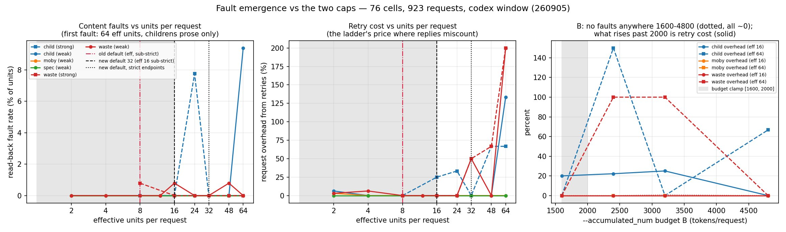
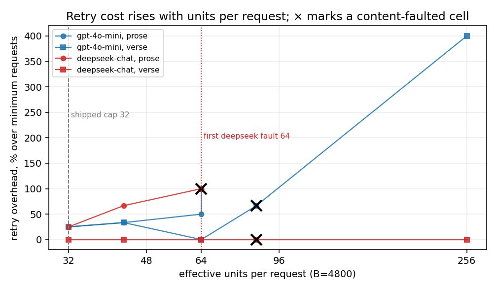
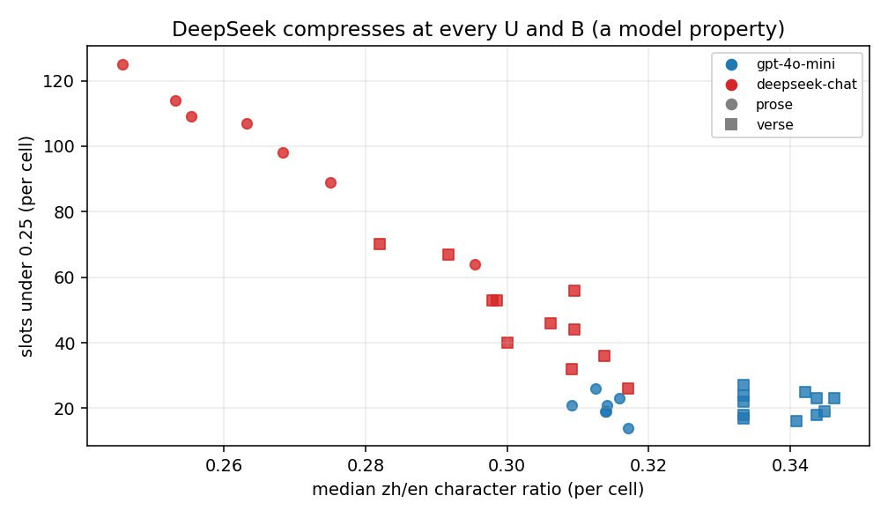

# Why 16 units per request, and why the budget halves on weaker endpoints

## Abstract

Plan mode puts several units (paragraphs, verse lines, cells) into one request. Two limits bound a request: a unit cap (`--max-batch-units`) and a token budget (`--accumulated_num`). Two paid studies asked where requests start to go wrong. A 210-request study across five endpoints found every request-level fault in its 50-unit bucket. A 923-request sweep found the first content fault at 64 effective units per request, on literary prose only, and no fault anywhere across budgets of 1600 to 4800 tokens. The shipped defaults sit well below both: 16 units and a 1200 to 1600 token budget, halved on endpoints that do not verify a strict JSON schema. **These defaults are an owner-set safety margin, not a measured optimum.** The measurements say larger requests are cheaper per translated word; the owner chose margin over that saving.

## Setup

**The degradation study (September 4, 2026).** 210 requests, 5 arms, request sizes of 500, 1000, 2000, 4000 and 8000 characters, up to 50 units per request. The batches were byte-identical across arms at each size, built by the branch's own planner from childrens-literature, moby-dick, jlreq-in-english and mahabharata. Arms: `gpt-4o-mini` and `gpt-5.6-luna` on OpenAI's endpoint, luna and `claude-sonnet-5` through a reseller, and `deepseek-v4-flash` through OpenRouter. Faults were judged by fixed rules: lazy tail compression, truncation, digit preservation.

**The fault-emergence sweep (September 5, 2026).** 76 valid cells and 923 requests on the Codex route: 46 specified cells plus a 30-cell extension to 64, 96 and 128 units once the route's own halving was found to cap the grid at 24 effective units. Four epub-samples books: childrens-literature (literary prose), moby-dick-mo (a long novel), epub30-spec (short technical units) and wasteland (verse). Two models: `gpt-5.4-mini` and the Codex default. Every cell was read back from the produced EPUB. A content fault is a translation in the wrong slot, a missing one, or marker residue in the text.

**A weak-model rerun** of both axes on `gpt-4o-mini` and `deepseek-chat`. It is known from the September 2026 grouping report and its two figures below; there is no dated record with its per-cell table.

## Results

The degradation study, largest clean request size per arm:

| arm | largest clean rung | notes after correction |
|---|---|---|
| off-mini (official 4o-mini) | 1000 | real faults at 2000+ (below) |
| off-luna (official luna) | **8000, all clean** | its rule-4 trips are zh-numeral false positives |
| rtr-luna (nianhuaapi luna) | **8000, all clean** | only delta vs official: 2.4–6× latency |
| rtr-sonnet (nianhuaapi claude-sonnet-5) | none | 0/30 schema-valid JSON — wire format, not translation |
| or-deepseek (OpenRouter deepseek-v4-flash) | ~4000 | + source-echo fault (below), 6.6× completion-token burn, slowest |

- Lazy tail compression never tripped (worst 88% against a 70% threshold). Zero truncation in 210 requests. 36 of 39 unmatched digit runs were correct Chinese numerals.
- **Every request-level fault outside rtr-sonnet was in the 50-unit bucket.** Unit count, not character budget, was the binding axis.
- One silent tail shift: `gpt-4o-mini`, 8000 characters, 50 alternating quote/citation units. The ids came back in order but the translations of roughly slots 44 to 49 were shifted by one. The id echo cannot catch this shape.
- The id echo caught what it was built for: a 50-unit mahabharata batch came back with ids 0 to 21 and 28 paragraphs missing, reported as a success by the endpoint.

The fault-emergence sweep:

- **First content fault at 64 effective units per request**, childrens-literature prose only, 9.4% of units. moby, spec and wasteland were clean through 64. The Codex default model's 7.8% at 24 units was a single misaligned request, clean at 32, 48 and 64.
- **Content per request, not unit count, carries the risk.** 4705 source tokens in 48 units were clean; 3563 tokens in 64 units faulted; 64 units of short lines (600 to 1100 tokens) were clean.
- **The token budget was fault-free across 1600 to 4800.** What rises past about 2000 is retry cost: +150% request overhead at 2400 with large unit counts.
- Misalignment is U-shaped: two-unit batches misaligned on 3 of 4 books (harmless; the ladder lands on single units), the middle was mostly silent, and at 64 the retry misaligned again.
- The sweep found a real corruption path: a one-slot shift that survived reconciliation put three literal `⟦spanN⟧` tokens into visible prose. It is fixed: such a batch now goes down the halving ladder instead of being written.

*Figure: fault rate and retry cost against units and budget, 76 cells, 923 requests. The lines show the defaults of the time (32 units, a 1600 to 2000 budget), before the September 7 ruling. Source: 260905-eval-FAULT_EMERGENCE_UB-RESULTS.md.*

The weak-model rerun: a raised unit cap costs retries first and faults later, so the cap is the knob to lower and the budget is not.

DeepSeek compressed aggressively at every cap and budget (median zh/en character ratio 0.25 to 0.31, against gpt-4o-mini's 0.31 to 0.35). Short translations on that model are the model, not a grouping fault.

*Figures: weak-model rerun, from the September 2026 grouping report; no dated record carries the per-cell table.*

## Decision

On September 5 the sweep's lead set the cap to 32 (half the measured emergence) and kept a 2000-token ceiling on retry-cost grounds. On September 7 the owner lowered every grouping default:

| constant | old | new |
|---|---|---|
| `GENERAL_GROUP_MAX_UNITS` (plan.py) | 32 | **16** (quarter of the 64-unit measured fault onset) |
| `SUBSTRICT_GROUP_MAX_UNITS` | 16 (derived `//2`) | **8** (still derived) |
| `substrict_batch_cap` (chatgptapi) | 16 | **8** |
| `SESSION_BUDGET_FLOOR` / `CEILING` | 2400 / 3200 | **1200 / 1600** |
| `SUBSTRICT_BUDGET_FLOOR` | derived 1200 | **typed 800** (deliberately NOT `floor//2`=600 — no double margin) |

The owner's reasons, as recorded: schema support is an endpoint property, not evidence that the model follows instructions; strong models are not necessarily better at format compliance; and a fault means the model cannot hold the request together. A shifted slot is a wrong book, not an expensive one. So a safety margin outranks the measured per-content savings (15.5 input-equivalents per content token at a budget of 800 against 12.3 at 1600).

Why the halving on weaker endpoints: both content regressions the September 5 JSON-object eval found were large batches, and an endpoint without a strict-schema verdict cannot be told apart from one where miscounted replies live. So on such an endpoint the unit cap is 8 and the per-request budget is 800.

What would change it: a rerun of the sweep that shows faults below 16 on some model (lower it), or the owner deciding the margin is worth less than the savings (raise it). Until then, lower `--max-batch-units` when a run prints `misaligned batches this run`; raise it only for cost, at your own risk, and never past 48.

## Limits

- **The sweep's "weak" model was `gpt-5.4-mini`, which is not a weak-model proxy.** It is unusually strong at format compliance. The sweep's finding that "the weak model held the reply format better than the strong one" (2 recoveries in 9 childrens cells against 5 in 6) is therefore unproven for genuinely weak models. The `gpt-4o-mini` and DeepSeek rerun is the weak-model evidence, and it has no dated record with a table.
- Only four books, and only childrens-literature reached prose at 128 units; moby and spec spent their test slice on front matter.
- Nothing between 16 and 64 units was measured on an on-device model.
- The token budget was measured fault-free only from 1600 up, and only at the old 32-unit cap. The shipped 800 to 1600 sits below the measured range on purpose.

Source: docs/260905-eval-FAULT_EMERGENCE_UB_DESIGN.md, docs/260905-eval-FAULT_EMERGENCE_UB-RESULTS.md, docs/260904-eval-GENERAL_BATCH_DEGRADATION-DESIGN.md, docs/260904-eval-GENERAL_BATCH_DEGRADATION-RESULTS.md, docs/260907-fix-CONSERVATIVE_GROUP_DEFAULTS.md (repository, dated records)
