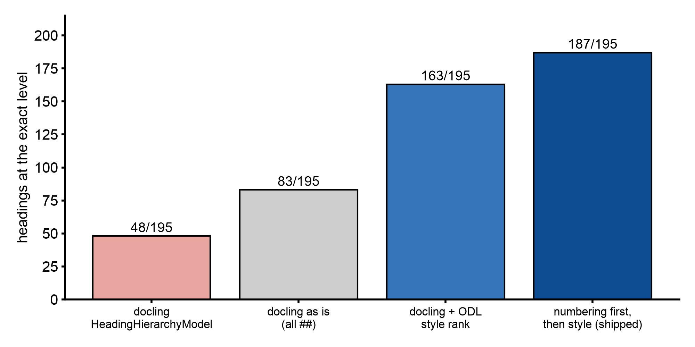

# Why heading levels are read from the page and docling's heading model stays off

## Abstract

docling finds headings well but writes every one of them as `##`: the paper's title, `1 Introduction`, `2.1` and `3.2.1` alike. The EPUB's table of contents is built from those levels, so a flat list of headings is a flat book. Four ways to assign levels were scored against hand-made ground truth on 20 arXiv papers (195 headings docling found). Reading the numbering first and the glyph style second got 187 of 195 levels exact (95.9%) and 19 of 20 papers fully right. docling's own `HeadingHierarchyModel`, off by default, got 48 of 195 (24.6%): worse than leaving every heading flat. The route ships the numbering-first rule and keeps docling's model off.

## Setup

- **Corpus:** twenty arXiv papers, cut to five pages each.
- **Ground truth:** 196 headings with levels. The title is level 1; numbering gives the rest objectively; unnumbered headings were judged from page renders. Renders for six papers were lost to a context limit, so their ground truth rests on numbering plus a font dump.
- **Matching:** normalized text, 0.85 similarity or a common prefix of at least 12 characters.
- **The level rule that shipped** (`pdf_headings.py`):
    1. Numbering decides first: `1.` is level 2, `1.1` is 3, `I.` is 2, `A.` is 3, `1)` is 4. A bare `1 Intro` counts only when a neighbour in the same style vouches for it, so a year-led title stays a title.
    2. Otherwise the glyphs under the heading box, read with pypdfium2: rendered size times the text-matrix scale, and weight or face name.
    3. An unnumbered heading takes a numbered sibling's level in the same style; otherwise the largest style is the title; otherwise 2.
- **Style rank attribution:** the style rank follows opendataloader-pdf's `HeadingProcessor` (Apache-2.0). Its detector, which calls GPL and MPL code, is not used.
- **Timing:** reading the glyphs under 201 headings across 100 pages took 2.0 s.
- **The benchmark of docling's model:** docling 2.129's `HeadingHierarchyModel` on the same corpus, the same ground truth and the same matcher. It is set through `PdfPipelineOptions.heading_hierarchy_options` and uses bookmarks, then numbering, then style.

## Results

Eval 1, detection and levels:

| arm | recall | junk | exact level | consecutive relation |
|---|---|---|---|---|
| ODL-java (its 260921 output) | 94/196 | 50 | 18/94 (92/94 with its one-level offset forgiven) | 73/75 |
| docling as shipped, flat `##` | 195/196 | 6 | 83/195 (42.6%) | 102/175 |
| docling + ODL's style rank | same | same | 163/195 (83.6%) | 153/175 |
| docling + numbering first, style rank as fallback | same | same | **187/195 (95.9%)**, 19/20 papers fully right | 170/175 |

The benchmark of docling's own model:

| arm | exact levels | papers fully right | note |
|---|---|---|---|
| ported rule (`pdf_headings.py`) | 187/195 (95.9%) | 19/20 | numbering first, then glyph style |
| docling HeadingHierarchyModel | 48/195 (24.6%) | 3/20 | title at the same level as its sections on 15/20 papers |
| docling as shipped (flat `##`) | 83/195 (42.6%) | 0/20 | every heading level 2 |

*Figure: exact heading levels on 20 arXiv papers. Numbers from 260922-eval-DOCLING_HEADING_HIERARCHY_BENCHMARK.md and 260922-feat-PDF_HEADING_LEVELS.md. Script: `docs/img/src/pdf_heading_levels.py`.*

opendataloader's levels were right when it found a heading, but it found fewer than half, and a third of what it called headings was junk: arXiv stamps, equation fragments, author names. docling's detector is far better, so only the level rule was ported. The one paper the rule got wrong (2010.03667v1) has no numbering and two heading levels set in one font; its eight level-3 headings come out at level 2.

## Decision

Heading levels are assigned by the numbering-first rule on docling's headings. docling's `HeadingHierarchyModel` stays off. A future docling release that changes that model gets re-measured with the same script before any switch.

## Limits

- Tuned and measured on arXiv papers. **Books are unverified**: chapter headings without numbering, running heads, unnumbered styles.
- A scanned page has no glyphs to read: numbering only, else level 2.
- Two levels set in one font with no numbering cannot be told apart.
- A run of years in one style (`2024 …`, `2025 …`) reads as numbering.
- The ground truth for six of the twenty papers rests on numbering and a font dump, not on page renders.

Source: docs/260922-eval-DOCLING_HEADING_HIERARCHY_BENCHMARK.md, docs/260922-feat-PDF_HEADING_LEVELS.md (repository, dated records)
