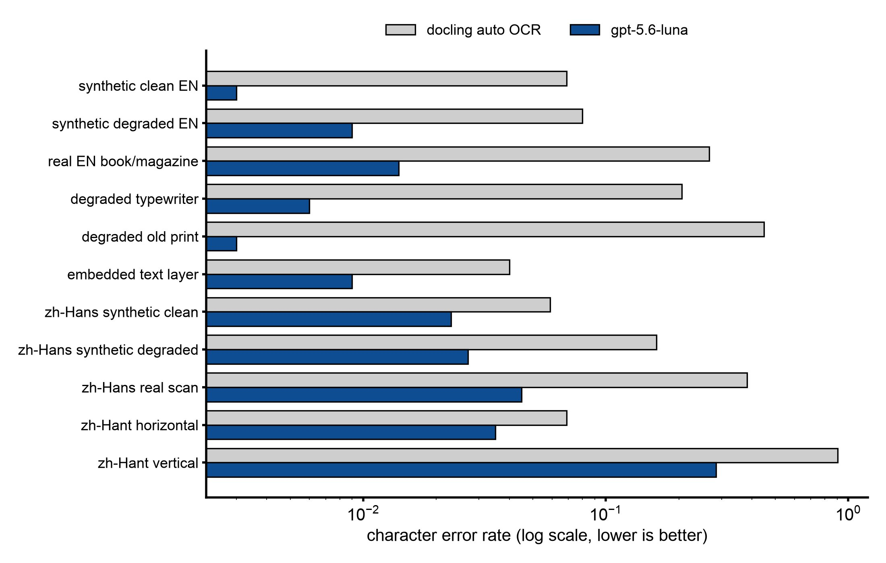

# Why a vision model reads a scanned page better than a local OCR engine

## Abstract

When a PDF page has no text layer, the `--to-epub` route asks docling's local OCR engine to read it. On this Mac, docling's automatic choice was rapidocr on onnxruntime. The study paired that engine against a vision model (gpt-5.6-luna) reading the page image, on 25 scanned pages with typed or exact ground truth. The vision model had the lower character error rate (CER) on all 25 pages. On real scans the local engine left 16 to 54% CER; the vision model stayed near 1%. The vision model is only safe at full resolution: at low resolution it invented whole pages of fluent text. The study also found that docling's default PDF backend renders some scan encodings wrong, so OCR returns nothing while the run reports success.

This build reads scans with docling's local OCR only. A vision reader is not a flag here.

## Setup

- **Local arm:** docling 2.129.0 with OCR set to auto, which resolved to rapidocr 3.9.2 with onnxruntime in 27 of 27 cells. rapidocr's default language is `ch` (its Chinese and Latin recognizer). Apple silicon, 16 GB, MPS for the layout and table models.
- **Vision arm:** gpt-5.6-luna reading the page rendered at scale 2 with image detail high, reasoning effort low. The prompt asked for a plain transcription in reading order, with `[illegible]` for unreadable words.
- **Pages:** two-page cuts of real scans (typewriter, book and magazine, old print, scans that already carry an OCR layer, simplified and traditional Chinese) plus synthetic scans made from born-digital pages (clean, and degraded with rotation, blur and JPEG q40).
- **Ground truth:** typed from the image for most real scans; exact (the source text layer) for the synthetic scans. For three pages (hekate, innerspace, hermeticum) it was drafted from the embedded layer and then corrected, which favors the layer.
- **Scores:** CER is order-sensitive; `line_err` ignores order; tau is Kendall's tau over matched lines, so it measures reading order.

## Results

Per-class results, copied from the record (auto default vs Luna at scale 2 / high):

| class | n pages | auto CER | Luna CER | auto WER/HanCER | Luna WER/HanCER | auto line_err | Luna line_err | auto tau | Luna tau | Luna s/page | Luna tokens p/c (mean) |
|---|---|---|---|---|---|---|---|---|---|---|---|
| synthetic clean EN (arxiv, eula) | 4 | 0.069 | 0.003 | 0.092 | 0.014 | 0.042 | 0.002 | 0.9 | 0.99 | 17.0 | 2566/657 |
| synthetic degraded EN | 4 | 0.08 | 0.009 | 0.095 | 0.021 | 0.021 | 0.002 | 0.93 | 0.99 | 21.8 | 2566/671 |
| real EN book/magazine scan (chaldean spread, forward) | 2 | 0.267 | 0.014 | 0.373 | 0.049 | 0.116 | 0.001 | 0.92 | 0.97 | 18.6 | 2618/1056 |
| degraded typewriter (CIA) | 3 | 0.206 | 0.006 | 0.237 | 0.006 | 0.12 | 0.0 | 0.9 | 0.89 | 16.3 | 2528/699 |
| degraded old print (deg1 colour pamphlet, deg2 bitonal novel) | 2 | 0.449 | 0.003 | 0.55 | 0.022 | 0.032 | 0.002 | 0.85 | 0.98 | 26.1 | 2006/1470 |
| scan with embedded OCR layer (hekate, innerspace, hermeticum*) | 3 | 0.04 | 0.009 | 0.08 | 0.044 | 0.025 | 0.003 | 0.99 | 1.0 | 16.4 | 1265/924 |
| simplified Chinese, synthetic clean | 2 | 0.059 | 0.023 | 0.027 | 0.005 | 0.045 | 0.006 | 0.93 | 0.83 | 27.5 | 2604/1502 |
| simplified Chinese, synthetic degraded | 2 | 0.162 | 0.027 | 0.105 | 0.007 | 0.068 | 0.01 | 0.89 | 0.83 | 30.2 | 2604/1376 |
| simplified Chinese, real scan (docling default backend) | 1 | 0.383 | 0.045 | 0.249 | 0.001 | 0.237 | 0.039 | 0.98 | 1.0 | 39.7 | 3042/1540 |
| simplified Chinese, real scan (pypdfium2 backend, full_page) | 1 | 0.145 | 0.045 | 0.045 | 0.001 | 0.052 | 0.039 | 0.98 | 1.0 | 39.7 | 3042/1540 |
| traditional Chinese, horizontal (hant2) | 1 | 0.069 | 0.035 | 0.06 | 0.042 | 0.05 | 0.031 | 1.0 | 1.0 | 29.0 | 1916/1855 |
| traditional Chinese, vertical (hant1) | 1 | 0.905 | 0.285 | 0.917 | 0.266 | 0.093 | 0.132 | -0.03 | 0.93 | 43.8 | 3161/1451 |

\* hermeticum is the holdout. Denominators are pages.

*Mean CER per class from the table above, log scale. Lower is better. Each class has one to four pages.*

- **Every page:** Luna had the lower CER on 25 of 25 paired pages.
- **Greek:** the local engine read 0 of 17 Greek lines; Luna read 17 of 17.
- **Where the local engine loses:** garbled line starts and whole lines on typewriter and old print; paragraph order scrambled on skewed pages; no Greek.
- **Where Luna loses:** it writes display equations the ground truth left out; it modernizes Chinese variant forms (爲 to 為); on the hardest Chinese page it substitutes plausible characters.
- **Cost of the vision arm:** median 2,528 prompt and 914 completion tokens per page, median 21 s per page (range 10 to 44 s).

**Low resolution invents text.** Two cells ran at scale 1 with detail low:

| page | scale/detail | prompt tok | completion (reasoning) | s | CER | what happened |
|---|---|---|---|---|---|---|
| cia p1 | 2 / high | 2528 | 704 (67) | 18.0 | 0.018 | faithful |
| cia p1 | 1 / low | 437 | 1502 (609) | 18.8 | 0.622 | paraphrased and invented |
| zh p1 | 2 / high | 3042 | 1540 (137) | 39.7 | 0.045 (Han 0.001) | faithful |
| zh p1 | 1 / low | 399 | 1534 (408) | 21.3 | 0.832 (Han 0.901) | entire page invented: a card-probability lesson that is not on the page |

Both invented replies ended normally, with no `[illegible]` marks. Detail low is not a cheaper tier; it is unsafe.

**Vertical traditional Chinese fails in both arms.** rapidocr recognized the characters well (`line_err` 0.093), but docling orders the columns left to right (tau −0.03), so the page reads backwards. Luna kept the right order (tau 0.93) but invented and duplicated passages and changed names and numbers.

**A page that already has an OCR layer:** keep the layer. Rerunning rapidocr over the whole page was worse on 3 of 3 pages (hekate 0.062 to 0.086, innerspace 0.018 to 0.121, hermeticum 0.023 to 0.075) and dropped the Greek. Luna beat the layer on all three (0.016, 0.004, 0.009). One exception: the Internet Archive Chinese scan's layer holds almost no Chinese, so a layer needs a quality check before it is trusted.

**The render defect.** docling's default PDF backend (docling-parse) draws MRC scans wrong: a JPX color background with JBIG2 text masks, the layout ABBYY FineReader and the Internet Archive produce. The page image comes out as a dark smear or pure white. OCR then finds nothing, only the log says "RapidOCR returned empty result!", and the conversion reports success. With the pypdfium2 backend the same pages read normally. The follow-up is on [Why docling-parse stays](pdf-page-render-backend.md).

**CPU against MPS** (one two-page typewriter scan): identical text, 26.3 s against 10.6 s, peak memory 2,080 MB against 2,259 MB. rapidocr runs on the CPU in both; only the layout and table models use MPS.

## Decision

The evidence favors a vision model for scanned prose. This build does not act on it: it reads scans with docling's local OCR only (`--pdf-ocr`), and has no flag that sends a page image to a model. The image-capability probe for an OpenAI-style endpoint is in the code, and an image-reading step is being built on the feature branch after this build. The owner ruled that image steps run only when an image model is named explicitly, never by falling back to the translation model. So the default run needs no vision model, and an on-device model is never asked to read a page.

What this means for you today:

- For a scan in a script other than Chinese or English, pass `--ocr-lang` with the engine's codes (the run prints which engine it chose).
- For an Internet Archive or ABBYY scan, check `source.md` before you translate. In this build `--pdf-ocr` can come back empty on such a page while the run completes.
- Vertical Chinese comes back in the wrong column order. Do not translate it unreviewed.

## Limits

- Measured on 25 pages, one to four per class. The vertical Chinese and real simplified Chinese rows are one page each.
- Three ground truths were drafted from the embedded layer, which favors the layer arm.
- Only docling's auto choice (rapidocr) was run. easyocr, ocrmac, tesseract and rapidocr with an explicit `--ocr-lang` were deferred. On a Mac with ocrmac installed, auto would pick ocrmac instead (read from the code, not run).
- One CPU cell; no CUDA machine.
- No price table for gpt-5.6-luna, so token counts were not converted to money.

Source: docs/260923-eval-PDF_OCR_LUNA_VS_LOCAL_BASELINE.md; docs/260923-feat-PDF_CHOICES_EXECUTION.md for the build status and the owner's image-model ruling (repository, dated records)
