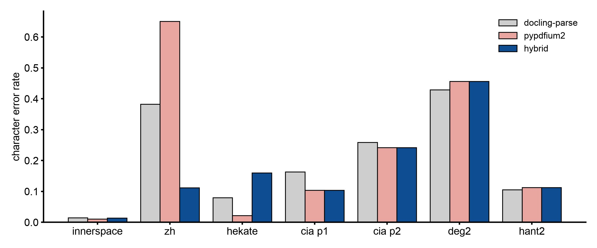

# Why the PDF route keeps docling-parse and only swaps the page image on JBIG2 scans

## Abstract

docling reads a PDF through a backend. The default, docling-parse, extracts the text cells and draws the page image that OCR and the layout model look at. On some scans that page image is wrong: docling-parse ignores an image mask stored as JBIG2, so a masked page comes out as a smear, pure white or pure black. OCR then reads nothing and the run still reports success. docling's other backend, pypdfium2, draws these pages correctly, but switching to it outright changed tables, links and reading order on born-digital pages, and made one Chinese scan worse. The measured answer is a hybrid: keep docling-parse for everything, and take only the page image from pypdfium2 when the file carries a JBIG2 mask.

The hybrid is implemented after this build. In this build the page image always comes from docling-parse.

## Setup

- docling 2.129.0, docling-parse 7.20.0, pypdfium2 5.13.0, Apple silicon, OCR set to auto (rapidocr in every OCR cell), tables accurate.
- **Three arms:** `parse` (the default), `pdfium` (pypdfium2 for everything), `hybrid` (docling-parse with the page image drawn by pypdfium2).
- **Born-digital pages:** 17 two-page slices (arXiv papers, lecture notes, a datasheet, browser-saved pages, Word documents, a form), no OCR.
- **Scans:** 7 pages with ground truth from six slices, scored with the scorer and ground truth of [the OCR study](pdf-ocr-llm-vs-local.md).
- **Detection:** 60 fixtures, pages 1 and 2 of each (120 pages), plus pages 13 to 16 of one book (render only).
- A determinism control reran `parse` on 5 slices; the output was identical, so every difference below comes from the backend.

## Results

**The defect.** docling-parse ignores any image `/Mask` whose stream is JBIG2Decode and paints the base image unmasked. It is not specific to JPX: one book with no JPX at all (hekate) has the pattern on 91 of 214 pages, and two of its pages render fully black. The upstream report is docling issue #4329.

**Detection.** "Some image on the page has a `/Mask` or `/SMask` stream in JBIG2Decode", read from the raw PDF, flagged 8 of 120 pages. Those 8 are exactly the pages where the docling-parse render differs from pypdfium2 by more than 30% of pixels; the other 112 differ by 6.9% or less. **8 of 8 found, 0 false positives, 0 misses.**

**What a full switch to pypdfium2 costs on born-digital pages:**

- Table columns merge (a section number joins its title) on 3 of 5 table slices, for example 8×6 → 8×4 on one author table. The content survives; the structure is coarser.
- Both hyperlinks on a browser-saved page are lost (2 → 0).
- One reading-order jump (1512.03385: an affiliation and caption move before the abstract).
- Time and memory are a wash:

| arm | Σ t_convert | median t_convert | median peak RSS | max peak RSS |
|---|---|---|---|---|
| parse | 50.0 s | 2.5 s | 952 MB | 1168 MB |
| pdfium | 48.4 s | 2.4 s | 934 MB | 1074 MB |
| hybrid | 48.9 s | — | 965 MB | 1172 MB |

The hybrid's born-digital text is identical to `parse` on 15 of 17 slices (whitespace ignored), and its table structure is identical on 4 of the 5 table slices.

**Scans, CER by character span, copied from the record:**

| slice (GT page) | arm | CER md page | CER charspan | Han CER | lines ok/misread/missed (of GT lines) | md chars | empty warnings | t_convert s | peak RSS MB |
|---|---|---|---|---|---|---|---|---|---|
| innerspace_mid (p1) | parse | 0.0179 | 0.0146 | — | 40/1/0 (41) | 5634 | **2** | 3.1 | 1031 |
| | pdfium | 0.0769 | 0.0112 | — | 40/0/1 | 4902 | 0 | 6.1 | 1545 |
| | hybrid | 0.0806 | 0.0142 | — | 40/0/1 | 5461 | 0 | 6.3 | 1325 |
| zh_hans_qm_mid (p1) | parse | 0.3828 | 0.3828 | 0.249 | 14/13/10 (37) | 3431 | **1** | 4.6 | 1763 |
| | pdfium | **0.6512** | 0.6512 | **0.846** | 2/8/27 | 1514 | 0 | 10.2 | 2101 |
| | hybrid | **0.1119** | 0.1119 | **0.0095** | 33/2/2 | 2830 | 0 | 10.4 | 2129 |
| hekate_mid (p1) | parse | 0.0795 | 0.0795 | — | 32/0/1 (+Greek 0/2/3 of 5) | 4534 | 0 | 8.1 | 1902 |
| | pdfium | **0.0220** | 0.0220 | — | 32/0/1 (+Greek 5/0/0) | 4762 | 0 | 7.6 | 1541 |
| | hybrid | 0.1598 | 0.1598 | — | 31/0/2 (+Greek 0/3/2) | 4361 | 0 | 8.8 | 1726 |
| cia_typewriter (p1) | parse | 0.1581 | 0.1635 | — | 39/0/6 | 4080 | 0 | 11.1 | 2462 |
| | pdfium | 0.0945 | 0.1042 | — | 42/0/3 | 4241 | 0 | 9.6 | 2317 |
| | hybrid | 0.0945 | 0.1042 | — | 42/0/3 | 4241 | 0 | 9.0 | 2049 |
| cia_typewriter (p2) | parse | 0.2717 | 0.2589 | — | 14/0/5 | (same cell) | 0 | | |
| | pdfium | 0.2666 | 0.2417 | — | 14/0/5 | | 0 | | |
| | hybrid | 0.2666 | 0.2417 | — | 14/0/5 | | 0 | | |
| en_degraded_2_mid (p1) | parse | 0.5433 | 0.4292 | — | 53/0/4 | 7655 | 0 | 9.1 | 2024 |
| | pdfium | 0.5426 | 0.4567 | — | 51/0/6 | 7579 | 0 | 10.8 | 2224 |
| | hybrid | 0.5426 | 0.4567 | — | 51/0/6 | 7579 | 0 | 8.7 | 1992 |
| zh_hant_scan_2_mid (p2) | parse | 0.0694 | 0.1053 | 0.0605 | 25/1/1 | 3539 | 0 | 9.3 | 1876 |
| | pdfium | 0.0768 | 0.1128 | 0.0624 | 24/2/1 | 3533 | 0 | 9.2 | 1705 |
| | hybrid | 0.0768 | 0.1128 | 0.0624 | 24/2/1 | 3533 | 0 | 9.1 | 1868 |

*CER by character span from the table above, one bar per backend. Lower is better. 7 pages.*

Reading the table:

- **The Internet Archive Chinese scan** is the case the fix is for. Under `parse`, OCR ran on a smear and the output is the poor embedded layer: Han CER 0.249. The hybrid lets OCR see the page: Han CER 0.0095.
- **Why the full switch is worse on that page** (0.846): pypdfium2's text cells carry no rendering mode, so docling treats the invisible OCR layer as visible and keeps it over fresh OCR. pypdfium2 decodes that layer to 54 Han characters; docling-parse decodes 750. The same mechanism makes `pdfium` look best on hekate: it keeps a good Greek layer, which is a policy change, not a better render.
- **hekate under the hybrid is worse** (0.080 → 0.160, one prose line dropped, noise inserted, n=1). hekate's pages 108 and 109 do not trigger the JBIG2 check, so under the decision they keep the `parse` render.

**A second defect, recorded and not fixed:** a JPX image in an indexed color space renders as a flat yellow box under docling-parse (mit_lecnotes12, page 1, Figure 1), so the layout model finds no picture and the figure is lost. pypdfium2 draws it correctly.

## Decision

Keep docling-parse as the backend. When a dependency-free scan of the file finds a JBIG2 `/Mask` or `/SMask`, take only the page image from pypdfium2. Do not switch to the pypdfium2 backend, and never while OCR is on.

On the feature branch this landed as `14ec784`, after the build this wiki describes. That version records `render_backend` in the manifest and prints a `JBIG2_MASK_RENDER` line when it swaps the image. Measured there, rapidocr on the Chinese scan went from Han CER 0.249 to 0.0095, and three born-digital fixtures came out byte-identical. With ocrmac as docling's auto engine and no `--ocr-lang`, the same page got worse (Han CER 0.291 → 0.494): the readable page was now OCR'd as Latin. Given `--ocr-lang zh-Hans,en-US`, ocrmac reached Han CER 0.056. The same branch therefore prints the `--ocr-lang` hint when a page carries only an invisible text layer.

In this build: if you translate an Internet Archive or ABBYY scan with `--pdf-ocr`, read `source.md` first. A page that looks right in a PDF viewer can reach OCR as a smear.

## Limits

- 7 scored scan pages, one per slice except CIA; hekate's hybrid regression is n=1.
- /Rotate pages were not exercised by the hybrid.
- Detection was checked on pages 1 and 2 of 60 fixtures plus four pages of one book, not on whole books.
- The yellow-box defect has no fix and no upstream report yet.

Source: docs/260923-eval-PDF_BACKEND_JBIG2_MASK_RENDER.md; docs/260923-fix-PDF_JBIG2_PAGE_IMAGE_BACKEND.md for the implementation and its measurements (repository, dated records)
