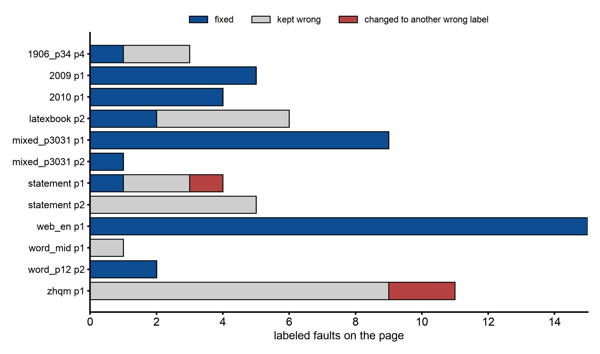

# Where an LLM fixes a layout detector's mistakes, and where it cannot

## Abstract

docling cuts each page into regions (paragraph, heading, footnote, code, table, picture and so on) and puts them in reading order. When a region has the wrong role or the wrong order, the book shows it: a code listing printed as footnotes, section 2 before section 1, a figure missing above its caption. The study catalogued docling's faults on 85 pages, then asked a vision model (gpt-5.6-luna) to relabel the regions it could see. The model fixed most wrong labels on born-digital pages. It could not fix what only shows across pages (running headers), and it could not rebuild a page docling had shattered into fragments. Those need rules based on page geometry, run before any model.

The role pass is built: `--img-model` on the [PDF route](../features/pdf-to-epub.md#correcting-region-roles-with-a-vision-model). The geometry repairs the study calls for are not built yet, so running headers and shattered pages still come through as docling made them.

## Setup

- docling 2.129.0 with the text layer only (no OCR), on 43 slices of one or two pages: 85 pages, of which 51 are arXiv, 16 other papers, 4 scans and 14 web or Word pages.
- **Catalogue:** every page rendered with its regions drawn and tagged, and each fault recorded by hand with a class and a severity (book-breaking, visible, minor).
- **Role pass:** 12 pages carrying at least one wrong-label or furniture fault. The model saw the tagged overlay and a list of region ids with their current label and first 80 characters, and answered one label per id, or `abstain`. A script scored the answers against the catalogue; the model did not judge itself.
- **Whole-page probe:** 3 pages with a missing region. The model saw only the clean page and returned regions with boxes; they were matched to docling's at IoU 0.5 or more.

## Results

**The catalogue: 123 faults, 13 book-breaking.** Copied from the record:

| fault_class | arXiv (26 sl/51 pp) | paper (8 sl/16 pp) | scan (2 sl/4 pp) | web (7 sl/14 pp) | total | book_breaking | visible | minor |
|---|---|---|---|---|---|---|---|---|
| wrong_label | 8 | 11 | 5 | 7 | 31 | 1 | 26 | 4 |
| paragraph_merge_split | 11 | 5 | 5 | 9 | 30 | 8 | 13 | 9 |
| column_order | 6 | 2 | 1 | 3 | 12 | 2 | 8 | 2 |
| heading_level | 0 | 6 | 0 | 5 | 11 | 0 | 1 | 10 |
| furniture_as_body | 2 | 1 | 3 | 4 | 10 | 0 | 8 | 2 |
| spurious_region | 7 | 2 | 0 | 0 | 9 | 0 | 3 | 6 |
| missing_region | 1 | 2 | 0 | 3 | 6 | 2 | 2 | 2 |
| caption_attachment | 2 | 2 | 0 | 2 | 6 | 0 | 4 | 2 |
| duplicate_asset | 1 | 0 | 0 | 3 | 4 | 0 | 0 | 4 |
| misplaced_asset | 1 | 0 | 0 | 1 | 2 | 0 | 2 | 0 |
| body_as_furniture | 0 | 1 | 0 | 1 | 2 | 0 | 1 | 1 |
| **all** | 39 | 32 | 14 | 38 | 123 | 13 | 68 | 42 |

Wrong labels are the most frequent class but break a book once. Shattered or wrongly merged paragraphs break it 8 times: an embedded OCR layer turned into 165 regions on one page, inline maths split into 49 one-glyph items, a code listing that lost every newline, and docling's cross-page merge gluing a paragraph to an author block.

**Missing text is not a usable trigger.** 0.00% of text-layer characters fell outside every region on 78 of 85 pages, and at most 1.23% on any page. A missing figure or equation has no text-layer characters to miss. The signs that do work are geometric: an orphan caption, a formula box holding only its number, a sliver picture where a table should be.

**The role pass, 12 pages:**

| page | regions | label faults | fixed | kept wrong label | changed to another wrong label | abstained | introduced errors | extra correct changes | prompt / completion (reasoning) tokens | latency s |
|---|---|---|---|---|---|---|---|---|---|---|
| arxiv_1906_00495v1_p34 p4 | 17 | 3 | 1 | 2 | 0 | 0 | 0 | 0 | 3442 / 239 (157) | 5.6 |
| arxiv_2009_12164v1_p12 p1 | 13 | 5 | 5 | 0 | 0 | 0 | 0 | 1 | 3346 / 199 (130) | 5.7 |
| arxiv_2010_03667v1_p12 p1 | 20 | 4 | 4 | 0 | 0 | 0 | 0 | 1 | 3431 / 351 (254) | 7.6 |
| latexbook_p12 p2 | 11 | 6 | 2 | 4 | 0 | 0 | 1 (13:text->key_value_region) | 1 | 3190 / 520 (460) | 9.0 |
| mixed_photo_code_1_p3031 p1 | 17 | 9 | 9 | 0 | 0 | 0 | 0 | 0 | 2958 / 165 (84) | 6.0 |
| mixed_photo_code_1_p3031 p2 | 9 | 1 | 1 | 0 | 0 | 0 | 0 | 0 | 2739 / 150 (100) | 5.3 |
| statement_p12 p1 | 24 | 4 | 1 | 2 | 1 | 0 | 1 (18:text->key_value_region) | 1 | 3555 / 625 (512) | 6.0 |
| statement_p12 p2 | 9 | 5 | 0 | 5 | 0 | 0 | 0 | 0 | 3145 / 143 (94) | 3.5 |
| web_en_chrome_1_p12 p1 | 21 | 15 | 15 | 0 | 0 | 0 | 0 | 1 | 3308 / 619 (512) | 10.6 |
| word_en_table_1_mid p1 | 16 | 1 | 0 | 1 | 0 | 0 | 0 | 0 | 3451 / 265 (186) | 6.9 |
| word_en_table_1_p12 p2 | 5 | 2 | 2 | 0 | 0 | 0 | 0 | 0 | 3018 / 29 (0) | 2.7 |
| zhqm_mid p1 | 164 | 11 | 0 | 9 | 2 | 0 | 0 | 0 | 7860 / 1014 (345) | 9.5 |
| **total (12 pages)** | | 66 | 40 | 23 | 3 | 0 | 2 | 5 | 43443 / 4319 | 78.4 |

*Catalogued label faults on the 12 pages from the table above, split by what the model did. 66 faults in all.*

- **Fixed 40 of 66.** Leaving out the bank-statement pages and the OCR scan, 39 of 46.
- **Running furniture: 0 of 8.** A bank statement's repeated header and regulatory block look like body text on a single page. Only their repetition across pages marks them.
- **A shattered OCR page: 0 of 11.** Relabeling fragments does not rebuild a page.
- **2 errors introduced**, both `text -> key_value_region`, low harm. 5 extra changes were correct (the document title). The model never abstained, not even on the 164-region page.
- **Cost:** 43,443 prompt and 4,319 completion tokens for 12 pages, 2.7 to 10.6 s per page.

**Whole-page probe, 3 pages:** the model found all 3 missing regions with the right label (a figure, an equation with its number, a census table). Its boxes matched docling's on 38 of 45 regions, with mean IoU 0.82 to 0.90, so a proposed box has to be snapped to the page's own glyph and image bounds before anything is cropped from it.

**Recognition, deferred.** Tables: docling's cell F1 0.888 against the model's 0.854 on 17 tables, where 7 ground truths equal docling's output by construction. docling's formula decoding ran 27 minutes on two pages without output and was killed.

## Decision

The plan that came out of this study:

1. Geometry repair runs first and is not a model's job: shattered lines and paragraphs, the cross-page merge, one-glyph slivers, code newlines, and running furniture found by repetition across pages.
2. Then a role pass over the cleaned region ids. This is the first model step, because it is the cheapest seam and the only measured win.
3. A whole-page proposal for missing regions, only on a page one of the three geometric triggers flags, with the box snapped and checked.
4. Reading order by a model is untested and stays a candidate. Table and formula recognition stay deferred.

A design consult (Codex, recorded) set the constraints for step 2:

- a thin image adapter on the OpenAI-style route, reusing the existing structured-output ladder;
- a role change is a typed replacement of the item, never a bare label write;
- furniture, tables, pictures and lists are out of the first pass;
- accepted changes apply atomically; a page with an unusual change rate is quarantined, not trimmed (changed after the first real runs, below);
- every decision is written to `decisions.json` for audit;
- off by default.

**What was built.** Step 2, the role pass, ahead of the geometry repairs. The model sees the page rendered with docling's regions tagged, and answers one label per eligible region (text, section_header, title, caption, footnote, code, or abstain) under a strict per-region schema. Eligible regions are body text, titles and headings that no caption or footnote refers to, outside table cells and formulas. Lists, formulas, tables, pictures and furniture are not asked about. Accepted answers replace the item with one of the right type, before the formula and heading steps run.

The first real runs, gpt-5.6-luna on pages 1-2 of four fixtures, copied from the record:

| fixture | asked | accepted (applied) | kept | rejected | quarantined pages | calls | prompt / completion tokens | seconds |
|---|---|---|---|---|---|---|---|---|
| arxiv_2010_03667v1 | 27 | 6 | 21 | 0 | 0 | 2 | 7001 / 368 | 9.9 |
| web_en_chrome_1 | 28 | 4 | 24 | 0 | 0 | 2 | 6930 / 365 | 8.8 |
| mixed_photo_code_1_p3031 | 15 | 1 (9 more quarantined) | 5 | 0 | 1 | 2 | 5538 / 177 | 6.2 |
| arxiv_1706_03762 (held-out) | 21 | 2 | 19 | 0 | 0 | 2 | 6645 / 322 | 7.8 |

The quarantine blocked the one book-breaking fix it met: on the code page the model was right on 9 of 10 answers, which crossed the 60% change threshold. So the owner dropped the quarantine. A page where more than 60% of the asked items change now keeps its changes and prints `Region roles: … on page N changed; read that page in source.md before translating.` Rerun without the quarantine, the eight listing lines export as code (eight separate code blocks, since adjacent code items are not merged yet). The held-out paper came out with 0 changed lines of Markdown.

**The image model is chosen explicitly.** The pass runs only on a model you name, with `--img-model` or a provider entry's `img_model`. The translating model is never used for images by fallback (owner ruling), so no default needs a model that reads images. The shipped `openai` provider entry names gpt-5.6-luna, so `--provider openai` turns the pass on; `--img-model none` turns it off. Before the pass, a one-image probe checks that the model can see a picture; if it cannot, docling's labels stand.

**On-device models:** about 3,000 prompt tokens per page is modest, but the 164-region page took 7,860, which is beyond an 8B-class model. Point the pass at a hosted vision model with `--img-base-url`, or leave it off.

## Limits

- The role pass is measured on 12 pages and the whole-page probe on 3. The class-to-fix table in the record is a direction, not a rate.
- The catalogue was made by one worker from overlays; heading levels on arXiv were not judged (a separate study covers them).
- Only one model (gpt-5.6-luna) was run. No on-device model was tried.
- The built pass was checked on pages 1-2 of four fixtures; label-only changes such as text to footnote change nothing in the export yet.
- No OCR engine ran in the catalogue; the two scans were read through their embedded layers.

Source: docs/260923-eval-PDF_STRUCTURE_FAULTS_LUNA_REGION_ROLES.md; docs/260923-eval-CODEX_CONSULT_STRUCTURE_DECISION_CLIENT.md for the design constraints; docs/260923-feat-PDF_ROLE_DECISIONS.md for what was built and its first runs; docs/260923-feat-ENDPOINT_OVERRIDES_CLASSIFIER_JEV.md for the `--img-model` flags and the owner's image-model ruling (repository, dated records)
