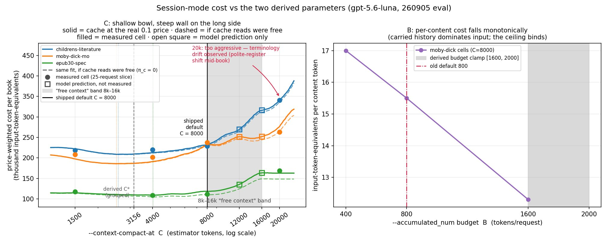
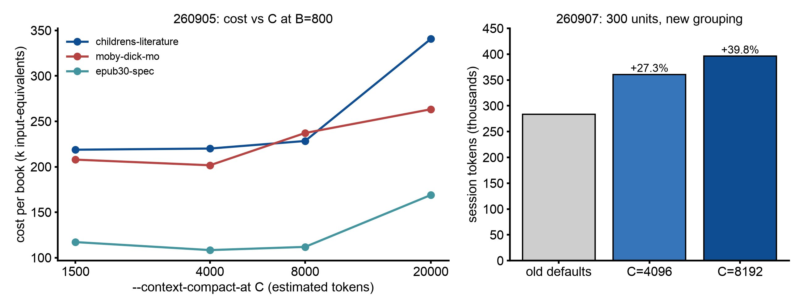

# Why the session window compacts at 8192 tokens

## Abstract

In session mode the history grows until it reaches `--context-compact-at`, then the model writes a handoff report and a new window starts. A short budget means many seams; a long one means every request re-reads a long history. An 18-run paid study on three books measured cost against the budget. The curve was flat from 1500 to 4000, rose after that, and rose steeply at 20000. Continuity held across 44 seams at a budget of 2500. After the grouping defaults were halved on September 7, a second measurement found that 8192 costs **more** than 4096: +39.8% against +27.3% over the old defaults on a 300-unit run. **The default stays at 8192 anyway, for continuity, not price.** A lower value is the cheaper setting.

## Setup

**The cost study (September 5, 2026).** 18 paid runs, `gpt-5.6-luna` on OpenAI's endpoint, 3.267M tokens, `--language zh-hans`, `--use_context session`, cells sized for about 25 requests each. Three epub-samples books: childrens-literature (literary prose with recurring names), moby-dick-mo (long chapters) and epub30-spec (short, repetitive technical units).

| phase | cells | what it measures |
|---|---|---|
| 0 | 3 books at stock defaults | calibration: per-request overhead F, JSON wrapper j, handoff prompt F_h, report size K |
| 1 | C ∈ {1500, 4000, 8000, 20000} × 3 books, B=800 | the cost-vs-C curve |
| 2 | B ∈ {400, 1600} on moby-dick (800 from phase 1) | the cost-vs-B curve |
| 3 | one full book at the solved optimum (B=1088, C=2500) | out-of-sample validation |

Cost is stated in input-token-equivalents: `(tokens_in − tokens_cached) + 0.1·tokens_cached + 4.0·tokens_out`, the vendor's price ratio. The meter of the time did not count the compaction turns themselves (up to 38% of true cost at C=1500; fixed since), so every total is metered cost plus the reconstructed compaction turns.

**The price check of the new defaults (September 7, 2026).** animal_farm, `gpt-5.6-luna`, session mode, 300 and 150 units, the new grouping (16 units, budget 1200 to 1600) at C=4096 and C=8192, against the pre-September defaults (budget 2400 to 3200, C=8000).

## Results

Total price-weighted cost per book, September 5:

| book | C=1500 | C=4000 | C=8000 | C=20000 | C* solved |
|---|---|---|---|---|---|
| childrens-literature | **218.8k** | 220.1k | 228.4k | 340.7k | 2512 |
| moby-dick-mo | 207.9k | **201.7k** | 237.2k | 263.3k | 2191 |
| epub30-spec | 117.2k | **108.4k** | 111.9k | 169.0k | 1580 |

- Flat within 0.6 to 3% across 1500 to 4000 on all three books; all three solved optima land there.
- The results record puts 8000 at 4 to 18% above the flat region. The grouping report, written later from the same cells, puts it at 9 to 25% above each book's own optimum. Both describe the same runs, measured against different baselines.
- C=20000 costs up to 56% more, and it is the only cell where drift appeared: a 你→您 register shift within one long window.
- **Continuity survives short windows.** The full-book run at C=2500 crossed 44 seams with zero terminology breaks in 1012 nodes (皇帝 62/62, 夜莺 38/38, 公主 34/34, 安徒生 12/12). The handoff report works as an accumulating name table.
- The model behind the curve predicted the full-book run's request count exactly (82/82) and its cost within −6.2%. That run was cheaper per content token (11.7) than every grid cell (13.1 to 20.4).
- Fitted constants: F=104, j=11.3 per unit, F_h=72, K=538 (139 reports), ρ 1.41 to 1.74, g 1245/920/645 per book, r 1.12 to 1.18, α rising with C (0.042 to 0.213 on childrens).

*Figure: the September 5 cost model and cells. It marks the defaults of that day (C=8000, a 1600 to 2000 budget clamp), before the September 7 ruling. Open squares at 12000 and 16000 are model predictions. Source: 260905-eval-SESSION_COST_OPTIMIZATION-RESULTS.md.*

The price of the new grouping defaults, September 7:

| arm | 300-unit requests | all-in tokens | compactions |
|---|---|---|---|
| old defaults | 33 | 283,361 | 8 |
| new caps, C=4096 | 63 | 360,681 (+27.3%) | 19 |
| new caps, C=8192 | 52 | 396,197 (+39.8%) | 9 |

At 150 units: +5.9% at 4096 and +24.0% at 8192. Raising C from 4096 to 8192 brought the compaction count back to the old level (19 to 9, against 8), as intended, and made the bill worse. The halved budget multiplies the requests (33 to 52 or 63), and every request re-reads the carried history: the prompt load per request was 7007 (old), 4690 (at 4096) and 6537 (at 8192). Caching did not rescue it: 9k to 21k tokens cached against about 340k of prompt.

*Figure: numbers from 260905-eval-SESSION_COST_OPTIMIZATION-RESULTS.md (left) and 260907-fix-CONSERVATIVE_GROUP_DEFAULTS.md (right). Script: `docs/img/src/session_compact_cost.py`.*

## Decision

`--context-compact-at` defaults to **8192** on every session run, grouped or not, the Codex route included. The run prints it at start.

The reason is continuity, for the many people who run this tool on local-device models, whose cost curve is not the hosted, cached one measured here. It is **not** the cheap setting. Under the current grouping budget, a lower value is cheaper: at 300 units, 4096 used 360,681 tokens against 396,197 at 8192. Past 16000 the cost rises steeply, and the only drift ever observed lived in the long-window cell.

What would change it: a new measurement of both cells (4096 and 8192) under a changed grouping budget, or a continuity measurement on local models. Do not move either number without re-running those two cells.

For you: leave it unset for the fewest seams. Set it lower (toward 4096) if session cost matters more to you than seams. Set it to your model's input limit if that is smaller. The minimum is 1500.

## Limits

- One model (`gpt-5.6-luna`) on one endpoint with prompt caching. Uncached and local endpoints were not measured.
- Each cell was a single run of about 25 requests; differences under about 30% on one run are close to noise.
- The September 7 price check used one book (animal_farm) at two sizes.
- The continuity result rests on one full book (childrens-literature, zh-hans).

Source: docs/260905-eval-SESSION_COST_OPTIMIZATION-DESIGN.md, docs/260905-eval-SESSION_COST_OPTIMIZATION-RESULTS.md, docs/260907-fix-CONSERVATIVE_GROUP_DEFAULTS.md (repository, dated records)
