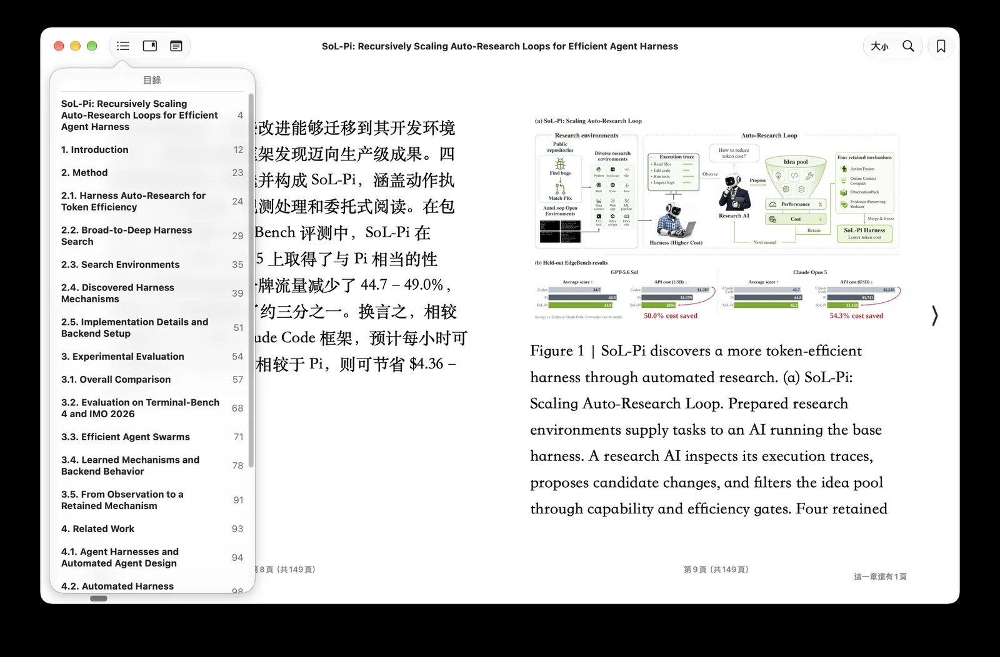

# PDF to bilingual EPUB

If you want a PDF as a bilingual book with a table of contents, read two pages first, then run the whole file:

```bash
python make_book.py --book_name paper.pdf --to-epub --pages 1-2 --test
python make_book.py --book_name paper.pdf --to-epub --use_context session
```

Read `paper_pages-1-2_book/source.md` between the two. [Recommended settings for PDF](recommended-pdf.md) has the command for each kind of document and each system.

This route is experimental. It has been checked on arXiv papers and a set of books, scans and browser-saved pages, not on every PDF shape. Issues and pull requests are welcome; attach the PDF if it can be shared, or the page of `source.md` that came out wrong.

## What it does

`--to-epub` reads the PDF with [docling](https://github.com/docling-project/docling)'s layout and table models into Markdown, translates that Markdown with the Markdown loader, and has Pandoc build a reflowable bilingual EPUB. Every paragraph is followed by its translation, and the table of contents follows the headings. Heading levels are read from the page itself: numbering first (`1.`, `1.1`, `I.`, `A.`), then font size and weight. Figures stay pictures, and each display formula is cropped from the page as a picture and placed where it stood. Pages with no text layer, a scan, are read by the OCR models only when you pass `--pdf-ocr`; a scan whose text layer is wrong can have it replaced with `--ocr-replace-layer`. If you name a vision model with `--img-model`, it looks at each page and corrects the roles docling gave the regions (a heading that is really an author line, a code listing read as footnotes) before the Markdown is written.

Everything lives in a working folder beside the PDF, `<name>_book/`: `source.md` (the extraction), `images/`, `book_bilingual.md` (the translation) and a manifest. The finished book is copied out as `<name>_bilingual.epub`. Rerunning the same command reuses the extraction and a finished translation, so you can stop, read `source.md`, fix a heading, and go on without paying twice. A PDF is a page description, not a document: it stores glyphs at positions and knows nothing of paragraphs or headings, so every extractor guesses the structure back. A heading one level off or a table that arrives as prose is the format showing through, and a minute's edit in `source.md`.

`source.md` marks where each page starts with a comment, `<!-- page N -->`. N is the page's number in the PDF file, counted from 1: the numbers `--pages` takes, not the number printed on the page. A page with nothing on it keeps its marker, so the numbering never slips. Rarely, docling returns an item with no page. Such items are written once, at the end of `source.md`, under `<!-- unplaced -->`, and the run says how many. Their place in the reading order is lost: move them where they belong, or delete them, before you translate.



*An arXiv paper after the route, open in Apple Books. The contents come from the paper's headings.*

## Setup

1. Install the PDF extra from a clone of the repository, `pip install ".[pdf]"` (Linux without an NVIDIA card and Windows with one add PyTorch's own index: [Installing the PDF extra](../installation-pdf.md)). You also need Pandoc **3.1.12 or newer** on PATH. No Java.
2. The models (about 500 MB) download on the first run.
3. Read the first two pages before anything longer, and read `source.md`, the headings at least, before you pay for the full translation. They become the table of contents.

The route's flags:

| flag | what it does |
|---|---|
| `--to-epub` | Take this route. |
| `--pdf-ocr` | Read pages that have no text layer. Off by default: a born-digital PDF is already readable, and OCR costs several times the time without changing what is read. Layout, heading and table detection run either way. |
| `--ocr-replace-layer` | With `--pdf-ocr`: OCR every page and use that text instead of the text layer the PDF carries. Off by default: a layer is kept and only pages without one are OCR'd. For a scan whose layer is wrong (another language, or garbage from a poor OCR); on a clean scan the layer reads better than the local engine. Turning it on or off reads the PDF again on the next run. |
| `--ocr-lang LANGS` | With `--pdf-ocr`: the languages the OCR engine reads, in its own codes. With the pdf extra alone, `auto` picks rapidocr, which runs on torch and downloads about 31 MB of models on first use: its models are in the rapidocr package, but onnxruntime, which runs them, is not in the extra (`pip install onnxruntime` avoids the download); on a Mac with `ocrmac` installed it picks ocrmac, which downloads nothing. [Which OCR engine](pdf-ocr-engines.md) has the measurement. The codes: rapidocr `ch`, `en`, `latin`; easyocr `ch_sim`, `ja`, `ko`; ocrmac `zh-Hans`, `ja-JP`. A BCP-47 tag behind `iso:` (`iso:zh`, `iso:ja`, `iso:zh-Hant`) works on every engine, so it is the safe choice when you do not know which one will run. rapidocr has no `ch_sim`: for Chinese write `iso:zh`. rapidocr reads one language per run and uses the first. The run prints the engine and languages it used. |
| `--ocr-engine ENGINE` | With `--pdf-ocr`: which OCR engine reads the pages: `auto` (default; the first installed of ocrmac, rapidocr, easyocr), `rapidocr`, `ocrmac` (macOS, nothing to download), `easyocr` or `tesseract`. An engine that is not installed is refused before any page is read. Which to choose, measured: [Which OCR engine](pdf-ocr-engines.md). |
| `--device auto\|cpu\|cuda\|mps\|xpu` | Where the models run. `auto` detects CUDA or MPS and falls back to the CPU. The CPU gives the same text, only slower. |
| `--pages 12-30` | Only these pages, numbered from 1 (`1,3,5-7` works too). The book gets its own names: `<name>_pages-12-30_book/`, `<name>_pages-12-30_bilingual.epub`. |
| `--no-formula-images` | Leave display formulas as `<!-- formula-not-decoded -->` placeholders. Almost never what you want: the parser never reads equations, so without the pictures the mathematics is missing. |
| `--img-model MODEL` | A vision model that corrects region roles from the page image. Off unless named here or as the provider entry's `img_model`; never the translating model by fallback. `none` turns an entry's model off. See [Correcting region roles](#correcting-region-roles-with-a-vision-model). |
| `--img-base-url URL` | Where that model is served, when it is not the run's endpoint (OpenAI-compatible only). |
| `--img-key KEY` | The key for `--img-base-url`. Defaults to the run's key on the run's own endpoint. |

Every Markdown-loader flag works unchanged: `--use_context session` (recommended), `--glossary`, `--parallel-workers` (not with a session), `--no-thinking`, `--test`. The full list is on [PDF](../formats/pdf.md). A combination the translation would refuse, such as `--no-thinking` on the codex route, is refused before the extraction starts, so nothing is paid for first. `--classify-model` does nothing on this route yet; the run warns.

## Correcting region roles with a vision model

docling cuts each page into regions and labels them: text, heading, title, caption, footnote, code, table, picture. Some labels are wrong, and the book shows it: an author line in the table of contents, a code listing printed as prose, a figure label promoted to a section. With `--img-model`, each page is shown to the model with docling's regions drawn and numbered on it. The model answers one role per region (text, heading, title, caption, footnote, code) or abstains. Accepted answers replace the labels before the Markdown is written, so the contents and the code blocks come out right. The text itself is never rewritten.

- **What it cannot fix.** Lists, tables, pictures, formulas and running headers and footers are not asked about. A scanned page that docling has shattered into fragments is not rebuilt by relabeling them.
- **What it costs.** About 3,000 prompt tokens per page; 2.7 to 10.6 s per page in the study. In the study behind it, the model fixed 40 of 66 wrong labels on 12 pages; see [Where an LLM fixes layout](../evaluation/pdf-structure-llm-roles.md).
- **What it needs.** An OpenAI-compatible endpoint that accepts images. The run checks once that the model can read a picture. If it cannot, the run says so and extracts with docling's own labels.
- **The model is named, never assumed.** The step runs only on a model you name with `--img-model` or in the provider entry's `img_model`. The shipped `openai` entry names `gpt-5.6-luna`, so `--provider openai` turns the step on; `--img-model none` turns it off. An on-device translating model is never asked to read a page.
- **Changing it extracts again.** The image model and its address are part of what the extraction is compared against, so adding, changing or dropping `--img-model` reads the PDF again. A bundle whose role pass did not finish is also read again when a run asks for the pass.

The decisions are kept in `<name>_book/.work/extraction/decisions.json`. At the end of the extraction the run prints the pass's token usage on its own line: `Image model (<model> at <address>): …`.

## Recommended commands

Every PDF starts with two pages and a few translated blocks (`--pages 1-2 --test`), then a read of `source.md`. The command for a novel, a textbook, a paper, a scanned book, a scan with a bad text layer and a Chinese scan, and the install and device for macOS, Linux with NVIDIA, Windows, a CPU-only machine and Docker, are on [Recommended settings for PDF](recommended-pdf.md).

## What can go wrong

Every failure on this route prints one line starting with `Error:`, before anything is paid for where it can. These are the lines, and what to do.

### Before extraction

- **`Pandoc is required for --to-epub. Install it and make sure pandoc is on PATH.`** Install Pandoc 3.1.12 or newer from [pandoc.org](https://pandoc.org/installing.html).
- **`pandoc 3.1.3 is too old for EPUB export; Pandoc 3.1.12 or newer is required …`** Your Pandoc came from apt (Ubuntu 24.04 ships 3.1.3, Debian 13 ships 3.1.11). Install the release and put it first on PATH; the line names the harness `tools/pdf_to_book.py --pandoc PATH` as the other way.
- **`reading a PDF needs the pdf extra, which is not installed.`** From a clone, `pip install ".[pdf]"` (step 3 of [Installing the PDF extra](../installation-pdf.md)). Not `pip install "bbook_maker[pdf]"`.
- **`--device cuda was asked for, but the installed PyTorch is a CPU-only build.`** Reinstall through the CUDA route. **`… but this machine has no cuda accelerator available.`** Use `--device cpu` or `--device auto`.
- **`--parallel-workers is not supported with --use_context session …`** Choose one.
- **`--no-thinking has no request to travel in on the codex route: …`** Drop `--no-thinking` on codex.
- **`--img-model needs an OpenAI-compatible endpoint; … resolves to the … format.`** The image model is asked at the run's endpoint, or at `--img-base-url`, and that endpoint is not OpenAI-shaped. Give an OpenAI-compatible `--img-base-url` (and `--img-key`), or drop `--img-model`.
- **`--img-base-url names where --img-model is served, and no --img-model was given. …`** Name the model too.
- **`--ocr-replace-layer re-reads pages that already carry a text layer with the OCR engine, so it needs --pdf-ocr.`** Add `--pdf-ocr`.

### During extraction

- **`N of M selected pages have no text layer (page(s) …); rerun with --pdf-ocr to read them with the OCR models.`** The PDF (or part of it) is a scan. Add `--pdf-ocr`.
- **`No --ocr-lang given: the OCR engine reads its own default languages, which may not be the pages'; …`** Then **`OCR engine: rapidocr (docling's choice on this install), languages: the engine's defaults.`** Check `source.md`. If the scan is not in Chinese or English, rerun with `--ocr-lang`; the bundle is read again.
- **`The parser produced no text for a document whose pages have no text layer; the OCR pass returned pictures only.`** or **`Warning: no text was recognised on page(s) …`** The engine could not read the script. Rerun with `--ocr-lang` for the page's language.
- **`The parser returned no text for this PDF; there is nothing to translate. If its pages are scans, rerun with --pdf-ocr.`** As it says.
- **`Warning: page N extracted C characters, several times what a printed page holds; inspect source.md before translating.`** Something on that page, usually a figure, carries far more text than it shows. A page whose Markdown is thousands of lines is junk, not a long page. Remove it from `source.md` or leave the page out with `--pages`.
- **`The PDF carries JBIG2 image masks, which docling-parse renders wrongly (docling issue #4329); page images are rendered by pypdfium2 instead, the text layer still by docling-parse.`** Information. Scans from the Internet Archive and ABBYY FineReader often use such masks, and docling-parse would draw the page as a smear. The run takes the page image from pypdfium2 for the whole document. See [Why docling-parse stays](../evaluation/pdf-page-render-backend.md).
- **`N of M selected pages carry only an invisible OCR text layer (a scanned book with recognised text underneath); that layer is kept as the page's text …`** Information. With `--pdf-ocr` the layer may be mixed with what the OCR engine reads, so name the language with `--ocr-lang`; in the wrong language a readable page turns to garbage. If the layer itself is garbage, rerun with `--pdf-ocr --ocr-replace-layer` and the language.
- **`OCR: replacing the embedded text layer on every page (--ocr-replace-layer)`** Information. Without `--ocr-lang` the language hint follows.
- **`page N: the OCR engine read nothing where the PDF carried a text layer; …`** With `--ocr-replace-layer`, that page came back empty and stays an empty page: its layer is not used in its place. The line also goes into the manifest's limitations; past ten pages the rest are counted (`... and N more`). Rerun with `--ocr-lang` for the page's language, or without `--ocr-replace-layer` to keep the layer.
- **`The OCR engine read nothing on any selected page, and with --ocr-replace-layer the PDF's text layer is not used, so there is nothing to translate; …`** The run stops before any translation is paid for. The manifest records the failed attempt: the reason, the empty pages and the settings used. The usual cause is the wrong `--ocr-lang`, or none on a scan outside the engine's default languages. Rerun with the right one, or without `--ocr-replace-layer` to keep the layer.
- **`N item(s) carry no page number; they are placed after the last page in source.md.`** Rare. docling returned items without a page. They are at the end of `source.md`, under `<!-- unplaced -->`, and their place in the reading order is lost. Move them where they belong, or delete them, before you translate.
- **`… has no model for the OCR language 'ch_sim'. …`** The engine does not know that code; the message lists the ones it does. On rapidocr, write `iso:zh` for Chinese. Nothing was read.
- **`… did not read the probe image (…); image steps are skipped this run.`** The image model cannot see pictures at that endpoint. The extraction goes on with docling's own labels.
- **`Region roles: A of B asked items changed by <model> (… kept, … rejected, … pages with many changes); overlay at <path>.`** Information: what the image model changed. **`Region roles: C of D asked items on page N changed; read that page in source.md before translating.`** Most of a page changed; the changes are kept, so look at it. **`Region roles: …; the detector's own labels stand there.`** Part of the pass did not finish (a budget ran out, an answer was rejected, a region went unanswered); those regions keep docling's labels.
- **`Extracting again: the bundle's region-role pass is <status>; this run asks for --img-model …, which only a complete pass satisfies.`** Information. The earlier pass did not finish, so the PDF is read again.
- **`--img-model <model> failed: …`** The image endpoint answered with an error that waiting does not fix, such as a rejected key. The run stops. Fix the key (`--img-key`) or the address.

### After extraction, before translation

- **`The document does not open with a top-level heading, so a heading "<name>" was added above its text; …`** The EPUB's contents need a level-1 heading at the start. Rename it in `source.md` before translating if you like.
- **`Page 12: the selection starts inside a section, so a heading "Page 12" was added above its prose; …`** The same, for a `--pages` range that starts mid-section.
- **`The page selection is not one run of pages, so pages 1-7 were read and the ones outside the selection dropped afterwards; …`** A range with a gap reads everything it spans. A single range reads fewer pages.
- **`Display formulas kept as images: N. …`** Information: the equations are pictures and are not translated.
- **`Warning: a formula region on page N covers S% of the page, which is a layout mistake rather than an equation; …`** That region stays a placeholder instead of a picture of the whole page. The other `Warning: … formula …` lines mean one formula could not be placed; its placeholder stays.
- **`Unsupported Markdown structure: raw tex '\s' at block 29 … Normalize the source before translation.`** The extractor does not escape Markdown in prose, so a sentence containing `\s`, `[u](y)` or `<k>` reads as raw TeX, a link or HTML. Escape it in `source.md` and rerun; the extraction is not repeated.
- **`Reusing the extraction made with docling … on …; this run would use docling … on …. Delete the bundle directory to extract again.`** Information. The extraction came from another device or docling version.

### Translation and export

- **`Translation reused: … (same source and settings; delete it to translate again).`** Information. Delete `book_bilingual.md` to translate again.
- **`Error: translate failed: Source or translation settings changed; start a new translation bundle.`** You changed the model, the language or `source.md` after a partial translation. Rerun with the original settings, or move the bundle aside and start over.
- **`Error: … Bilingual Markdown was edited; export it or use a new output directory.`** You edited `book_bilingual.md` by hand. That is allowed, but the run will not overwrite it.
- **`EPUB navigation is invalid: …`** The headings do not form a usable table of contents. Fix the heading levels in `source.md` (one `#` title, then `##`, `###`) and rerun.
- **`Interrupted. Rerun the same command to resume.`** Ctrl+C. Rerun; the stages that finished are not repeated.

### After the run

- **`Image model (<model> at <address>): tokens: …`** The image model's own usage, printed after the extraction, apart from the translation's.
- **`Nothing on this route classifies yet, so --classify-model is ignored on a … book.`** A classify flag or a provider's `classify_model` reached the translation of `source.md`, where nothing classifies. Harmless.

### Limits to know

- Figures stay pictures and their labels are not translated.
- The EPUB carries no `bbm_translation_metadata.json`, and `--no_disclosure` is not honored on this route yet: the credit line is always added.
- `--glossary-auto` learns only when a compaction happens, so a short paper at the default budget learns nothing.
- `--ocr-replace-layer` on a scan with a good visible layer reads worse than the layer (fewer characters, visible misreadings), so keep it for a layer that is wrong. On a scan with an invisible layer the two give nearly the same text.
- With an invisible layer, `--pdf-ocr` alone already has the OCR engine read the page, which is why the Chinese numbers above are close. Keeping such a layer untouched while OCR is on is not possible yet.
- The manifest records a failed attempt only for the all-empty stop.
