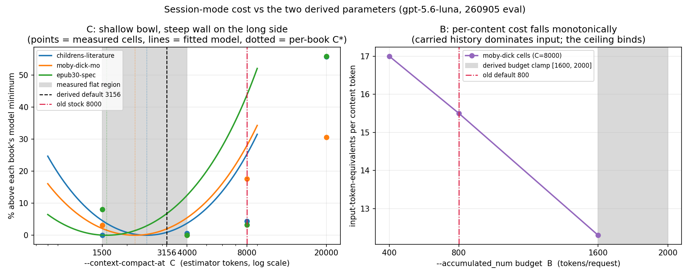
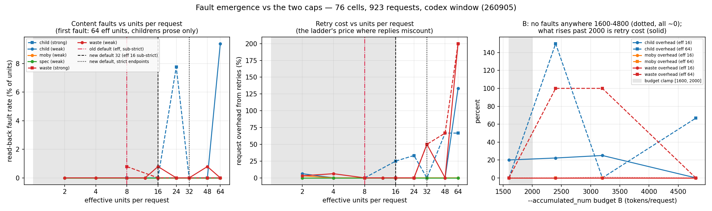

# Session grouping: how it batches, and where the defaults come from

A measurement report, September 2026. This documents (a) the grouping
strategy plan mode uses to batch translation units, (b) the paid
evaluation (18 runs, `gpt-5.6-luna`, 3.27M tokens, three books from
[epub-samples](https://github.com/IDPF/epub-samples)) that the session-mode
defaults for `--accumulated_num` and `--context-compact-at` are derived
from, and (c) the follow-up fault-emergence sweep (76 cells, 923
requests, four books, two models) that the `--batch_units` default is
derived from — plus how to pick these parameters for your own endpoint
(§7). Raw artifacts (per-cell logs, handoff reports, bilingual epubs,
ledgers) live outside the repository; every number used below is
reproduced in this page.

## 1. The grouping strategy

Plan mode (`--model_list`-independent; entered automatically for API
backends that pass its gates) replaces the one-request-per-paragraph loop
with **token-budget batches**:

- The book's translatable units are grouped, in document order, into
  requests of at most **32 units** (16 on endpoints without a strict
  JSON-schema verdict — see §6) and at most **B tokens** of source text
  (`--accumulated_num` is B; `--batch_units` is the unit cap). Nothing is
  split mid-unit; a unit larger than B travels alone.
- Inline markup inside a unit (links, emphasis, spans) is replaced by
  numbered markers `⟦tag1⟧…⟦tagN⟧` before translation and restored after,
  so the model never sees raw HTML and cannot damage it.
- Each request asks for **structured output**: a JSON object whose entries
  echo each unit's id next to its translation. The id echo is what makes a
  many-unit answer verifiable — a reply that drops, merges or reorders units
  fails alignment checks instead of silently shifting every translation
  one slot.
- Backends differ in what they enforce, so there is a **capability
  ladder**: JSON schema → `json_object` → delimiter-separated → plain
  prompt, probed once per endpoint and remembered. A batch whose reply
  cannot be aligned is retried down a **halving ladder** (32 → 16 → …
  → 1 unit), so the worst case degrades to the old per-unit behaviour
  rather than to a broken book.
- With `--use_context session` the batches share one rolling
  conversation. When the carried history reaches **C estimated tokens**
  (`--context-compact-at`), the translator asks the model for a **handoff
  report** — names, register, terminology decisions so far — and starts a
  fresh window seeded with it. The report behaves as an accumulating
  terminology ledger, which is why short windows do not cost consistency
  (measured below).

The question the eval answers: what should B and C default to, and does a
short C damage translation continuity?

## 2. Evaluation design

| phase | cells | what it measures |
|---|---|---|
| 0 | 3 books at stock defaults | calibration: per-request overhead F, JSON wrapper j, handoff prompt F_h, report size K |
| 1 | C ∈ {1500, 4000, 8000, 20000} × 3 books, B=800 | the cost-vs-C curve |
| 2 | B ∈ {400, 1600} on moby-dick (800 from phase 1) | the cost-vs-B curve |
| 3 | one full book at the solved optimum (B=1088, C=2500) | out-of-sample validation |

Books: `childrens-literature` (literary prose, recurring character
names), `moby-dick-mo` (long novel chapters), `epub30-spec` (short,
repetitive technical units — the cache-friendly extreme). Every cell:
official OpenAI endpoint, `gpt-5.6-luna`, `--language zh-hans`,
`--use_context session`, cell sizes chosen so each run makes ~25
requests.

## 3. The measurement ledger, field by field

One row per run (`ledger.tsv` in the raw artifacts):

| field | meaning |
|---|---|
| `run_id` | phase and cell, e.g. `p1-moby-C4000` |
| `book` | epub-samples volume |
| `B` | `--accumulated_num`: source-token budget per request |
| `C` | `--context-compact-at`: history size (estimator tokens) that triggers compaction |
| `test_num` | `--test_num`: number of translation *units* in the cell (not requests — cell sizing replays the batcher offline) |
| `tokens_in` | billed prompt tokens, summed from the API's `usage` |
| `tokens_out` | billed completion tokens |
| `tokens_cached` | `cached_tokens` — a **subset** of `tokens_in` served from prefix cache at a 0.1 price weight; never add it to `tokens_in` |
| `requests` | translation requests issued |
| `compactions` | compaction seams crossed |
| `exit` | process exit status |

One honesty note: at eval time the built-in meter did not count the
compaction turns themselves (a defect the eval found; fixed since —
they could be up to 38% of true cost at C=1500, i.e. the meter looked
best exactly where it lied most). All totals below are metered cost
*plus* the reconstructed compaction turns.

**Price weighting.** Costs are stated in *input-token-equivalents*:
`(tokens_in − tokens_cached) + 0.1·tokens_cached + 4.0·tokens_out`,
matching the vendor's uncached-input : cached-input : output price ratio
of 1 : 0.1 : 4.

## 4. The cost model, symbol by symbol

Per request, session mode:

```
cost/request = E + c_h·C/2 + (g/C)·(F_h + π_o·K)
```

| symbol | fitted value | meaning |
|---|---|---|
| `E` | — (per book) | fixed payload: prompt overhead + the batch itself; has no C in it |
| `F` | 104 | per-request prompt overhead, tokens (system + instructions) |
| `j` | 11.3/unit | JSON wrapper cost of the structured batch (measured at the then-default 16 units) |
| `C` | free variable | compaction trigger; the average request carries ~C/2 history |
| `c_h` | 0.65–1.08 | billed price of one carried history token: `((1−α) + α·0.1)·r` |
| `α` | 0.04–0.47 | fraction of carried history served from cache; **rises with C** (each compaction destroys the cache prefix — the force that opposes short C) |
| `r` | 1.12–1.18 | billed tokens per estimator token (the trigger counts a 4.0 chars/token estimate; the bill counts the real tokenizer) |
| `g` | 645–1245 | history growth per request, estimator tokens; multiplies the compaction *rate* — this, not E, is what survives the derivative |
| `F_h` | 72 | the compaction prompt |
| `K` | 538 | mean handoff report length (139 reports) |
| `π_o` | 4.0 | output price relative to uncached input |
| `ρ` | 1.41–1.74 | zh-hans output tokens per source content token |

Differentiating in C gives the optimum:

```
C* = √( 2·g·(F_h + π_o·K) / c_h )
```

## 5. Results



**C — a shallow bowl with one steep wall, on the long side.** Total
price-weighted cost per book:

| book | C=1500 | C=4000 | C=8000 | C=20000 | C* solved |
|---|---|---|---|---|---|
| childrens-literature | **218.8k** | 220.1k | 228.4k | 340.7k | 2512 |
| moby-dick-mo | 207.9k | **201.7k** | 237.2k | 263.3k | 2191 |
| epub30-spec | 117.2k | **108.4k** | 111.9k | 169.0k | 1580 |

Flat within 0.6–3% across [1500, 4000] on all three books — inside
single-run noise, and all three solved C* land in that region. The stock
8000 sits 4–18% above it; C=20000 costs up to 56% more. Being wrong short
is nearly free; being wrong long is not.

**B — the ceiling wins.** At fixed C, input cost is nearly flat in B
(129k / 132k / 147k at B = 400 / 800 / 1600) because carried history, not
content, dominates the prompt; content per request rises linearly. So
cost *per translated content token* falls monotonically: 17.0 → 15.5 →
12.3. What binds is the unit cap and batch-alignment risk (one
misalignment at B=1600, recovered by the halving ladder), not book
statistics — which is what the follow-up sweep in §6 measured directly.

**Continuity survives short C.** The full-book validation run at C=2500
crossed 44 compaction seams with zero terminology breaks across 1012
nodes (皇帝 62/62, 夜莺 38/38, 公主 34/34, 安徒生 12/12). The only drift
found anywhere in the grid — a 你→您 register shift — was in the
**C=20000** cell, a within-window drift in the run with almost no seams.
The handoff report re-states the accumulated name table at every seam;
one report even self-corrected a defect it noticed.

**Out-of-sample validation.** The full childrens-literature run at
(B=1088, C=2500) hit the predicted request count exactly (82/82), landed
within −6.2% of predicted total cost, and was cheaper per content token
(11.7) than every grid cell (13.1–20.4).

## 6. Where the unit cap comes from

The first eval anchored the cap at a conservative 16: a 210-request
degradation study across five endpoints had seen every request-level
fault live in its 50-unit bucket while 16 stayed clean, so 16 was a
safety margin, not a measurement. The follow-up sweep measured the
actual emergence: 76 cells / 923 requests over four epub-samples books
(literary prose, a long novel, a spec, verse), sweeping the effective
unit count to 128 and B across 1600–4800, on a deliberately weak model
(`gpt-5.4-mini`) with a stronger default as cross-check, every cell
read back from the produced epub rather than trusted from its log.



- **First content fault at 64 effective units per request**, literary
  prose only (9.4% of units on one book); the other three books were
  clean through 64.
- **Content per request, not the unit count, carries the risk**: 4705
  source tokens across 48 units translated clean, 3563 tokens across 64
  units faulted, and 64 units of short lines (600–1100 tokens) were
  clean. The token budget B is what actually bounds content.
- **The weak model held the reply format better than the strong one**
  (2 alignment recoveries in 9 cells vs 5 in 6): misalignment is format
  compliance, not competence, so a cap derived from the weak model alone
  would sit too high.
- **B was fault-free across the whole 1600–4800 range**; what rises past
  ~2000 is retry cost (+150% request overhead at B=2400 with large unit
  counts), which is why the derived default keeps its ceiling.
- The sweep also caught a real corruption path — a one-slot-shifted
  reply that survived reconciliation could deposit marker tokens into
  visible prose — now fixed: wrong-slot marker evidence sends the batch
  down the halving ladder instead of being written.

The default is set at **half the measured emergence: 32 units**, with
the existing halving to 16 on any endpoint that does not verify a
strict JSON schema — exactly the endpoints where reply miscounts were
observed. Measured retry overhead at those defaults is 0–25%.

## 7. Choosing the parameters for your endpoint

Everything below is a default-tuning guide; leaving all three flags
unset is correct on every route, because the run probes the endpoint
and derives them.

- **Endpoint verifies a strict JSON schema** (the official OpenAI API):
  the full cap (32) applies and every reply is schema-checked. Nothing
  to change.
- **Endpoint accepts JSON mode but not a strict schema**: the run
  halves the cap to 16 by itself. Do not raise `--batch_units` to undo
  it — the halved tier is where miscounted replies were actually
  observed.
- **No structured output at all** (the ChatGPT-plan/codex route, many
  resellers and proxies): translation uses the delimiter method and the
  plan is classified over a plain conversation; the effective cap is
  16 and the halving ladder absorbs miscounts. Trust the startup
  narration lines — they name the tier the probe found.
- **Resellers and routers**: the degradation study compared the
  official endpoint against a random domestic router serving the *same*
  model on byte-identical batches — zero structural faults on either
  side; the router's only measured tax was 2.4–6× latency. The same
  router serving an anthropic-family model over the openai wire format
  returned 0/30 schema-valid replies (fenced code blocks, unescaped
  quotes) while the translations inside were fine: **wire format, not
  model quality, is what degrades on a router**, and the probe + ladder
  exist to absorb exactly that. So: don't pre-shrink the caps for a
  router; let the probe grade it.
- **Weaker or smaller models**: don't pre-emptively lower
  `--batch_units` either — the sweep's weak model held format better
  than the strong one. Lower it (to 16, then 8) only when a run prints
  the misalignment hint (`N misaligned batches this run — consider a
  lower --batch_units or --accumulated_num`), which appears from the
  third recovered batch on.
- **`--accumulated_num`**: leave unset (the derived 1600–2000 band).
  Raising it toward 4800 produced no faults, but retry cost climbs past
  the ceiling and per-content savings flatten — the measured optimum is
  the derived band.
- **`--context-compact-at`**: leave unset; the cost curve is flat
  across 1500–4000 and the derived value lands inside it. Only a run
  with an unusually fat custom `--prompt` moves it, and the derivation
  already accounts for that.

## 8. The shipped defaults

Session-mode defaults only; an explicit flag always wins. They are
equations, not constants, because prompt overhead is user-customizable
(`--prompt`) and measured at run start:

```
B_default = clamp( 3·F, 1600, 2000 )          # F = measured prompt overhead
C_default = clamp( √(2 · 1.4·B · (72 + 4.0·538)), 1500, 4000 )   # grouped runs
```

With the stock prompts F ≈ 104–111, so B defaults to the floor 1600 and
C to **3156** — inside the measured flat region. F does not appear in
C* (it drops out of the derivative); prompt growth reaches C only
through B. Ungrouped session runs keep the old 8000: the fit was not
measured on per-paragraph exchanges, and extrapolating below the
measured range is guesswork. The clamps are pinned rather than fitted
because the curve is flat — the grid cannot resolve differences of 0.6%.

## 9. Reproducing a cell

```
python make_book.py --book_name childrens-literature.epub \
  --model gpt-5.6-luna --key "$OPENAI_API_KEY" \
  --use_context session --language zh-hans \
  --test --test_num 301 --context-compact-at 4000 --accumulated_num 800
```

Leave `--context-compact-at` and `--accumulated_num` unset to get the
derived defaults; the run narrates them
(`session: compacting at ~3156 estimated tokens (derived from the
1600-token request budget; --context-compact-at overrides)`).
